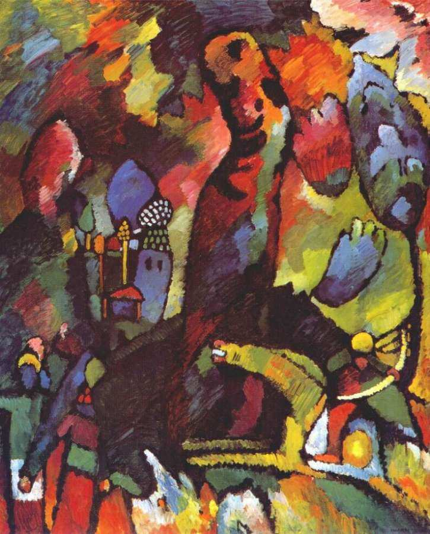

[🏠 Home](../../index.md)

# January 29

## 🧑‍🎨 Painting of the day

[Vasiliy Kandinskiy](http://en.wikipedia.org/wiki/Wassily_Kandinsky) (Expressionism, Abstractionism)

<button class="btn btn-success"
onclick=" window.open('https://lens.google.com/uploadbyurl?url=https://iretes.github.io/one-a-day/data/img/Vasiliy_Kandinskiy_4.jpg','_blank')">
Search with Google Lens
</button>

## 🎼 Song of the day

> *Help!*
by The Beatles

 Written by John Lennon, Paul McCartney.

Released in July, 1965 .

<button class="btn btn-success"
onclick=" window.open('http://www.youtube.com/search?q=Help! by The Beatles','_blank')">
Search on YouTube
</button>

## 🏛️ UNESCO heritage site of the day

> *Bisotun*, Iran (Islamic Republic of)

Bisotun is located along the ancient trade route linking the Iranian high plateau with Mesopotamia and features remains from the prehistoric times to the Median, Achaemenid, Sassanian, and Ilkhanid periods. The principal monument of this archaeological site is the bas-relief and cuneiform inscription ordered by Darius I, The Great, when he rose to the throne of the Persian Empire, 521 BC. The bas-relief portrays Darius holding a bow, as a sign of sovereignty, and treading on the chest of a figure who lies on his back before him. According to legend, the figure represents Gaumata, the Median Magus and pretender to the throne whose assassination led to Darius’s rise to power. Below and around the bas-reliefs, there are ca. 1,200 lines of inscriptions telling the story of the battles Darius waged in 521-520 BC against the governors who attempted to take apart the Empire founded by Cyrus. The inscription is written in three languages. The oldest is an Elamite text referring to legends describing the king and the rebellions. This is followed by a Babylonian version of similar legends. The last phase of the inscription is particularly important, as it is here that Darius introduced for the first time the Old Persian version of his res gestae (things done). This is the only known monumental text of the Achaemenids to document the re-establishment of the Empire by Darius I. It also bears witness to the interchange of influences in the development of monumental art and writing in the region of the Persian Empire. There are also remains from the Median period (8th to 7th centuries B.C.) as well as from the Achaemenid (6th to 4th centuries B.C.) and post-Achaemenid periods.

<button class="btn btn-success"
onclick=" window.open('http://www.google.com/search?q=Bisotun','_blank')">
Search on Google
</button>

## 🗺️ Place of the day

<iframe
src="https://www.mapcrunch.com"
name="mapcrunch"
width="500"
height="500"
allowTransparency="true"
scrolling="no"
frameborder="0"
>
</iframe>
## 🎨 Color of the day

> *[Navajo white](https://en.wikipedia.org/wiki/Navajo_white)*

&#9632;

## 🌿 Plant of the day

> *cutleaf toothwort*

<button class="btn btn-success"
onclick=" window.open('http://www.google.com/search?q=cutleaf toothwort','_blank')">
Search on Google
</button>

## 🧑‍🔬 Scientific discovery of the day

> *2019: The first image of a black hole was captured, using eight different telescopes taking simultaneous pictures, timed with extremely precise atomic clocks.*

<button class="btn btn-success"
onclick=" window.open('http://www.google.com/search?q=2019: The first image of a black hole was captured, using eight different telescopes taking simultaneous pictures, timed with extremely precise atomic clocks.','_blank')">
Search on Google
</button>

## 💭 Philosophical concept of the day

> *[Distrust](https://en.wikipedia.org/wiki/Distrust)*

## 🗣️ Saying of the day

> *Dead ringer*

An
exact duplicate.
