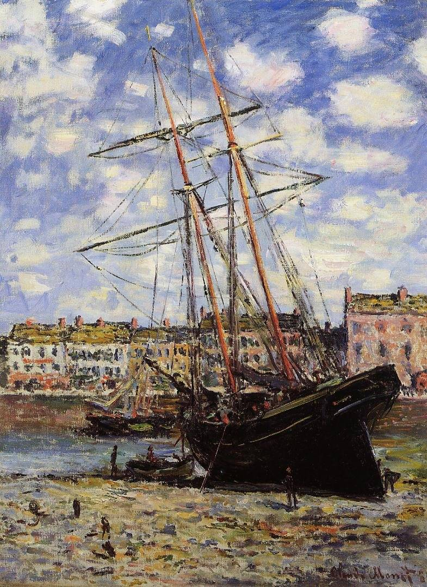

[🏠 Home](../../index.md)

# January 30

## 🧑‍🎨 Painting of the day

[Claude Monet](http://en.wikipedia.org/wiki/Claude_Monet) (Impressionism)

<button class="btn btn-success"
onclick=" window.open('https://lens.google.com/uploadbyurl?url=https://iretes.github.io/one-a-day/data/img/Claude_Monet_4.jpg','_blank')">
Search with Google Lens
</button>

## 🎼 Song of the day

> *I Walk the Line*
by Johnny Cash

 Written by Cash.

Released in Aug, 1956.

<button class="btn btn-success"
onclick=" window.open('http://www.youtube.com/search?q=I Walk the Line by Johnny Cash','_blank')">
Search on YouTube
</button>

## 🏛️ UNESCO heritage site of the day

> *Historic Centre of Santa Cruz de Mompox*, Colombia

Founded in 1540 on the banks of the River Magdalena, Mompox played a key role in the Spanish colonization of northern South America. From the 16th to the 19th century the city developed parallel to the river, with the main street acting as a dyke. The historic centre has preserved the harmony and unity of the urban landscape. Most of the buildings are still used for their original purposes, providing an exceptional picture of what a Spanish colonial city was like.

<button class="btn btn-success"
onclick=" window.open('http://www.google.com/search?q=Historic Centre of Santa Cruz de Mompox','_blank')">
Search on Google
</button>

## 🗺️ Place of the day

<iframe
src="https://www.mapcrunch.com"
name="mapcrunch"
width="500"
height="500"
allowTransparency="true"
scrolling="no"
frameborder="0"
>
</iframe>
## 🎨 Color of the day

> *[Lemon chiffon](https://en.wikipedia.org/wiki/Lemon_chiffon)*

&#9632;

## 🌿 Plant of the day

> *golden buttons*

<button class="btn btn-success"
onclick=" window.open('http://www.google.com/search?q=golden buttons','_blank')">
Search on Google
</button>

## 🧑‍🔬 Scientific discovery of the day

> *1675: Anton van Leeuwenhoek: observes microorganisms using a refined simple microscope.*

<button class="btn btn-success"
onclick=" window.open('http://www.google.com/search?q=1675: Anton van Leeuwenhoek: observes microorganisms using a refined simple microscope.','_blank')"> 
Search on Google
</button>

## 💭 Philosophical concept of the day

> *[Nothing](https://en.wikipedia.org/wiki/Nothing)*

## 🗣️ Saying of the day

> *In the box-seat*

In
a superior or advantageous position.
