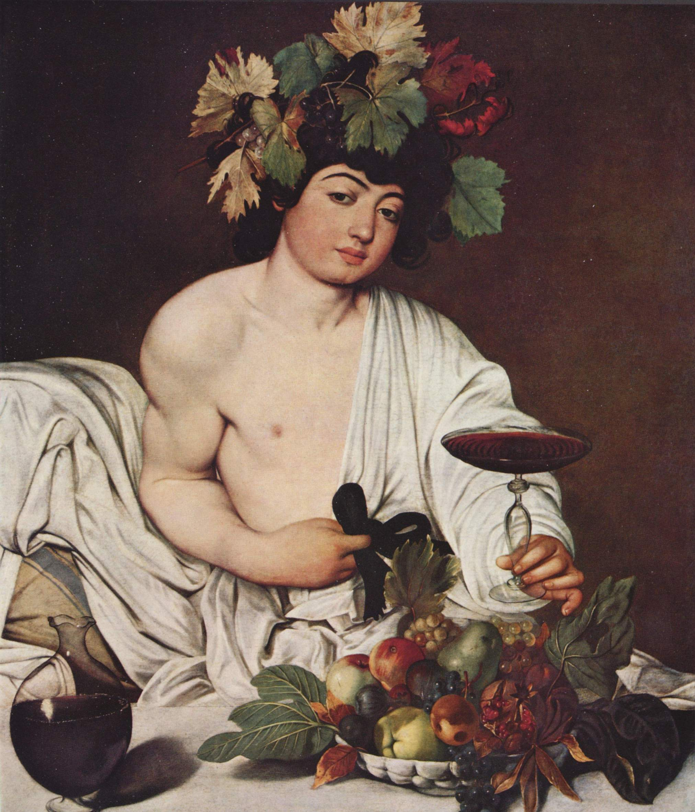

[🏠 Home](../../index.md)

# January 31

## 🧑‍🎨 Painting of the day

[Caravaggio](http://en.wikipedia.org/wiki/Caravaggio) (Baroque)

<button class="btn btn-success"
onclick=" window.open('https://lens.google.com/uploadbyurl?url=https://iretes.github.io/one-a-day/data/img/Caravaggio_2.jpg','_blank')">
Search with Google Lens
</button>

## 🎼 Song of the day

> *Stairway to Heaven*
by Led Zeppelin

 Written by Jimmy Page, Robert Plant.

Released in Nov, 1971.

<button class="btn btn-success"
onclick=" window.open('http://www.youtube.com/search?q=Stairway to Heaven by Led Zeppelin','_blank')">
Search on YouTube
</button>

## 🏛️ UNESCO heritage site of the day

> *Trinidad and the Valley de los Ingenios*, Cuba

Founded in the early 16th century in honour of the Holy Trinity, the city was a bridgehead for the conquest of the American continent. Its 18th- and 19th-century buildings, such as the Palacio Brunet and the Palacio Cantero, were built in its days of prosperity from the sugar trade.

<button class="btn btn-success"
onclick=" window.open('http://www.google.com/search?q=Trinidad and the Valley de los Ingenios','_blank')">
Search on Google
</button>

## 🗺️ Place of the day

<iframe
src="https://www.mapcrunch.com"
name="mapcrunch"
width="500"
height="500"
allowTransparency="true"
scrolling="no"
frameborder="0"
>
</iframe>
## 🎨 Color of the day

> *[Purple (web)](https://en.wikipedia.org/wiki/Shades_of_purple#Purple_(HTML/CSS_color)_(patriarch))*

&#9632;

## 🌿 Plant of the day

> *sneezeweed*

<button class="btn btn-success"
onclick=" window.open('http://www.google.com/search?q=sneezeweed','_blank')">
Search on Google
</button>

## 🧑‍🔬 Scientific discovery of the day

> *1789: Antoine Lavoisier: law of conservation of mass, basis for chemistry, and the beginning of modern chemistry.*

<button class="btn btn-success"
onclick=" window.open('http://www.google.com/search?q=1789: Antoine Lavoisier: law of conservation of mass, basis for chemistry, and the beginning of modern chemistry.','_blank')">
Search on Google
</button>

## 💭 Philosophical concept of the day

> *[Half-truth](https://en.wikipedia.org/wiki/Half-truth)*

## 🗣️ Saying of the day

> *Baby father*

The father of an infant who is not married to or in an exclusive relationship with the mother.
