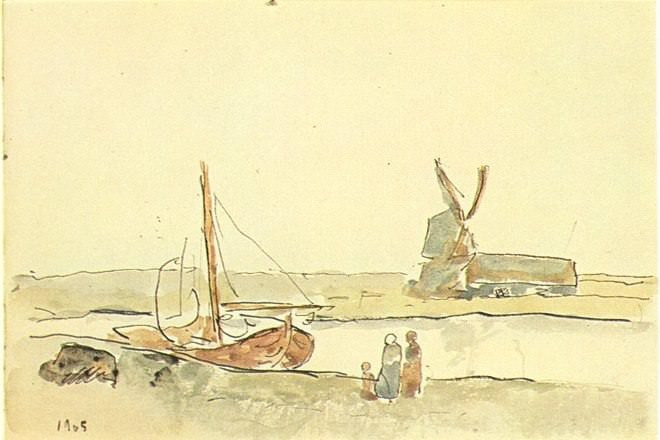

[🏠 Home](../../index.md)

# January 5

## 🧑‍🎨 Painting of the day

[Pablo Picasso](http://en.wikipedia.org/wiki/Pablo_Picasso) (Cubism)

<button class="btn btn-success"
onclick=" window.open('https://lens.google.com/uploadbyurl?url=https://iretes.github.io/one-a-day/data/img/Pablo_Picasso_7.jpg','_blank')">
Search with Google Lens
</button>

## 🎼 Song of the day

> *Respect*
by Aretha Franklin

 Written by Otis Redding.

Released in April, 1967.

<button class="btn btn-success"
onclick=" window.open('http://www.youtube.com/search?q=Respect by Aretha Franklin','_blank')">
Search on YouTube
</button>

## 🏛️ UNESCO heritage site of the day

> *Bagan*, Myanmar

Lying on a bend of the Ayeyarwady River in the central plain of Myanmar, Bagan is a sacred landscape, featuring an exceptional range of Buddhist art and architecture. The seven components of the serial property include numerous temples, stupas, monasteries and places of pilgrimage, as well as archaeological remains, frescoes and sculptures. The property bears spectacular testimony to the peak of Bagan civilization (11th -13th centuries CE), when the site was the capital of a regional empire. This ensemble of monumental architecture reflects the strength of religious devotion of an early Buddhist empire.

<button class="btn btn-success"
onclick=" window.open('http://www.google.com/search?q=Bagan','_blank')">
Search on Google
</button>

## 🗺️ Place of the day

<iframe
src="https://www.mapcrunch.com"
name="mapcrunch"
width="500"
height="500"
allowTransparency="true"
scrolling="no"
frameborder="0"
>
</iframe>
## 🎨 Color of the day

> *[Paolo Veronese green](https://en.wikipedia.org/wiki/Viridian#Paolo_Veronese_green)*

&#9632;

## 🌿 Plant of the day

> *common serviceberry*

<button class="btn btn-success"
onclick=" window.open('http://www.google.com/search?q=common serviceberry','_blank')">
Search on Google
</button>

## 🧑‍🔬 Scientific discovery of the day

> *2023: India successfully touched down near the south pole of the Moon with Chandrayaan-3's lander on August 23, making it only the fourth country to achieve the feat of reaching lunar surface after the US, China and the erstwhile Soviet Union.*

<button class="btn btn-success"
onclick=" window.open('http://www.google.com/search?q=2023: India successfully touched down near the south pole of the Moon with Chandrayaan-3 s lander on August 23, making it only the fourth country to achieve the feat of reaching lunar surface after the US, China and the erstwhile Soviet Union.','_blank')"> 
Search on Google
</button>

## 💭 Philosophical concept of the day

> *[Pattern](https://en.wikipedia.org/wiki/Pattern)*

## 🗣️ Saying of the day

> *Thumbs up*

A sign of acceptance, approval or encouragement, made with closed fingers and the thumb extended upwards. 
