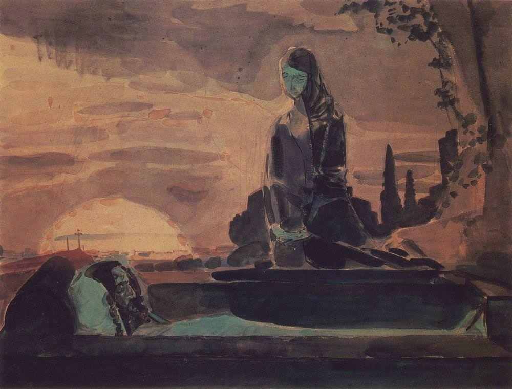

[🏠 Home](../../index.md)

# January 6

## 🧑‍🎨 Painting of the day

[Mikhail Vrubel](http://en.wikipedia.org/wiki/Mikhail_Vrubel) (Symbolism)

<button class="btn btn-success"
onclick=" window.open('https://lens.google.com/uploadbyurl?url=https://iretes.github.io/one-a-day/data/img/Mikhail_Vrubel_4.jpg','_blank')">
Search with Google Lens
</button>

## 🎼 Song of the day

> *Good Vibrations*
by The Beach Boys

 Written by Brian Wilson, Mike Love.

Released in October, 1966.

<button class="btn btn-success"
onclick=" window.open('http://www.youtube.com/search?q=Good Vibrations by The Beach Boys','_blank')">
Search on YouTube
</button>

## 🏛️ UNESCO heritage site of the day

> *Historic Centre of Lima*, Peru

Although severely damaged by earthquakes, this 'City of the Kings' was, until the middle of the 18th century, the capital and most important city of the Spanish dominions in South America. Many of its buildings, such as the Convent of San Francisco (the largest of its type in this part of the world), are the result of collaboration between local craftspeople and others from the Old World.

<button class="btn btn-success"
onclick=" window.open('http://www.google.com/search?q=Historic Centre of Lima','_blank')">
Search on Google
</button>

## 🗺️ Place of the day

<iframe
src="https://www.mapcrunch.com"
name="mapcrunch"
width="500"
height="500"
allowTransparency="true"
scrolling="no"
frameborder="0"
>
</iframe>
## 🎨 Color of the day

> *[Cyber yellow](https://en.wikipedia.org/wiki/Shades_of_yellow#Cyber_yellow)*

&#9632;

## 🌿 Plant of the day

> *golden garlic*

<button class="btn btn-success"
onclick=" window.open('http://www.google.com/search?q=golden garlic','_blank')">
Search on Google
</button>

## 🧑‍🔬 Scientific discovery of the day

> *By the 5th century: The elliptical orbits of planets are discovered in India by at least the time of Aryabhata, and are used for the calculations of orbital periods and eclipse timings.*

<button class="btn btn-success"
onclick=" window.open('http://www.google.com/search?q=By the 5th century: The elliptical orbits of planets are discovered in India by at least the time of Aryabhata, and are used for the calculations of orbital periods and eclipse timings.','_blank')"> 
Search on Google
</button>

## 💭 Philosophical concept of the day

> *[Moksha](https://en.wikipedia.org/wiki/Moksha)*

## 🗣️ Saying of the day

> *What's up Doc?*

'Eh, What's up Doc?' joins 'That's All Folks!' as the best-known lines from Tex Avery's Looney Tunes cartoon series. It was delivered by Bugs Bunny, while nonchalantly chewing on a carrot, in most of the cartoons in which the character appeared, beginning with A Wild Hare, 1940. This was the first Bugs Bunny cartoon, although Bugs wasn't named until the second cartoon - Elmer's Pet Rabbit ('Happy Rabbit', a prototype Bugs Bunny with a somewhat different personality had appeared earlier).
