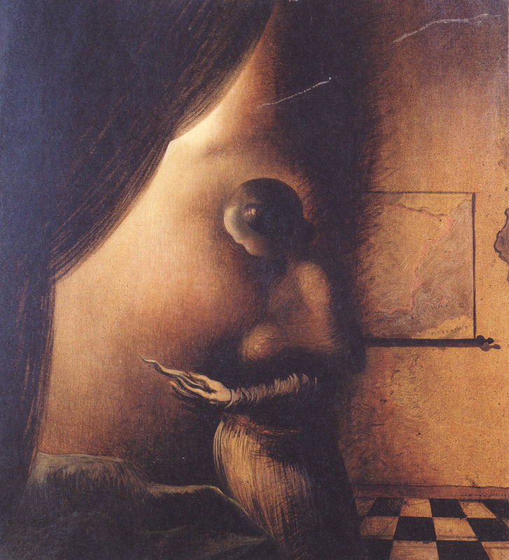

[🏠 Home](../../index.md)

# January 9

## 🧑‍🎨 Painting of the day

[Salvador Dali](http://en.wikipedia.org/wiki/Salvador_Dalí) (Surrealism)

<button class="btn btn-success"
onclick=" window.open('https://lens.google.com/uploadbyurl?url=https://iretes.github.io/one-a-day/data/img/Salvador_Dali_3.jpg','_blank')">
Search with Google Lens
</button>

## 🎼 Song of the day

> *Smells Like Teen Spirit*
by Nirvana

 Written by Kurt Cobain.

Released in Sep, 1991.

<button class="btn btn-success"
onclick=" window.open('http://www.youtube.com/search?q=Smells Like Teen Spirit by Nirvana','_blank')">
Search on YouTube
</button>

## 🏛️ UNESCO heritage site of the day

> *Port, Fortresses and Group of Monuments, Cartagena*, Colombia

Situated in a bay in the Caribbean Sea, Cartagena has the most extensive fortifications in South America. A system of zones divides the city into three neighbourhoods: San Pedro, with the cathedral and many Andalusian-style palaces; San Diego, where merchants and the middle class lived; and Gethsemani, the 'popular quarter'.

<button class="btn btn-success"
onclick=" window.open('http://www.google.com/search?q=Port, Fortresses and Group of Monuments, Cartagena','_blank')">
Search on Google
</button>

## 🗺️ Place of the day

<iframe
src="https://www.mapcrunch.com"
name="mapcrunch"
width="500"
height="500"
allowTransparency="true"
scrolling="no"
frameborder="0"
>
</iframe>
## 🎨 Color of the day

> *[Schauss pink](https://en.wikipedia.org/wiki/Baker-Miller_Pink)*

&#9632;

## 🌿 Plant of the day

> *annual sow thistle*

<button class="btn btn-success"
onclick=" window.open('http://www.google.com/search?q=annual sow thistle','_blank')">
Search on Google
</button>

## 🧑‍🔬 Scientific discovery of the day

> *1927: Georges Lemaître: Theory of the Big Bang*

<button class="btn btn-success"
onclick=" window.open('http://www.google.com/search?q=1927: Georges Lemaître: Theory of the Big Bang','_blank')"> 
Search on Google
</button>

## 💭 Philosophical concept of the day

> *[Sunyata](https://en.wikipedia.org/wiki/Sunyata)*

## 🗣️ Saying of the day

> *Act the giddy goat*

Behave foolishly. 
