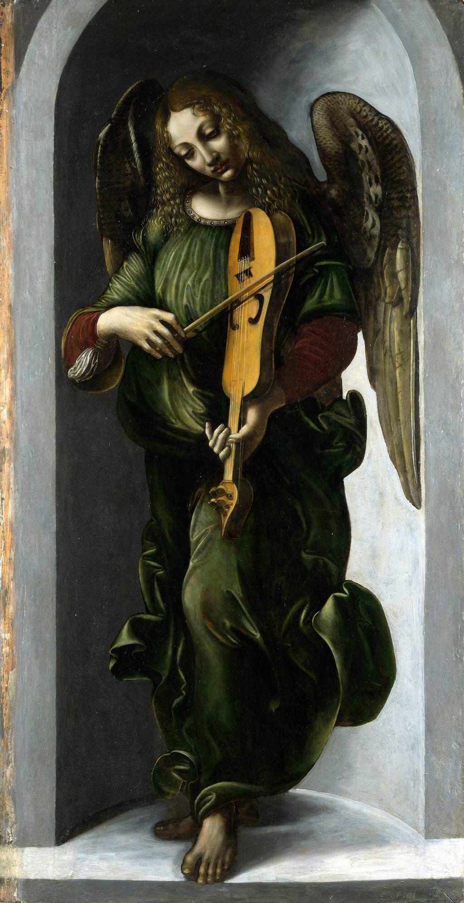

[🏠 Home](../../index.md)

# July 1

## 🧑‍🎨 Painting of the day

[Leonardo da Vinci](http://en.wikipedia.org/wiki/Leonardo_da_Vinci) (High Renaissance)

<button class="btn btn-success"
onclick=" window.open('https://lens.google.com/uploadbyurl?url=https://iretes.github.io/one-a-day/data/img/Leonardo_da_Vinci_3.jpg','_blank')">
Search with Google Lens
</button>

## 🎼 Song of the day

> *Lets Get It On*
by Marvin Gaye

 Written by Gaye, Ed Townsend.

Released in June, 1973.

<button class="btn btn-success"
onclick=" window.open('http://www.youtube.com/search?q=Lets Get It On by Marvin Gaye','_blank')">
Search on YouTube
</button>

## 🏛️ UNESCO heritage site of the day

> *Natural and Culturo-Historical Region of Kotor*, Montenegro

In the Middle Ages, this natural harbour on the Adriatic coast in Montenegro was an important artistic and commercial centre with its own famous schools of masonry and iconography. A large number of the monuments (including four Romanesque churches and the town walls) were seriously damaged by the 1979 earthquake but the town has been restored, largely with UNESCO’s help.

<button class="btn btn-success"
onclick=" window.open('http://www.google.com/search?q=Natural and Culturo-Historical Region of Kotor','_blank')">
Search on Google
</button>

## 🗺️ Place of the day

<iframe
src="https://www.mapcrunch.com"
name="mapcrunch"
width="500"
height="500"
allowTransparency="true"
scrolling="no"
frameborder="0"
>
</iframe>
## 🎨 Color of the day

> *[Pomp and Power](https://en.wikipedia.org/wiki/Shades_of_purple#Pomp_and_Power)*

&#9632;

## 🌿 Plant of the day

> *sweet rocket*

<button class="btn btn-success"
onclick=" window.open('http://www.google.com/search?q=sweet rocket','_blank')">
Search on Google
</button>

## 🧑‍🔬 Scientific discovery of the day

> *Late 5th century BC: Antiphon discovers the method of exhaustion, foreshadowing the concept of a limit.*

<button class="btn btn-success"
onclick=" window.open('http://www.google.com/search?q=Late 5th century BC: Antiphon discovers the method of exhaustion, foreshadowing the concept of a limit.','_blank')"> 
Search on Google
</button>

## 💭 Philosophical concept of the day

> *[Instantiation principle](https://en.wikipedia.org/wiki/Instantiation_principle)*

## 🗣️ Saying of the day

> *Oops-a-daisy*

An exclamation made when encouraging a child to get up after a fall or when lifting a child into the air.
