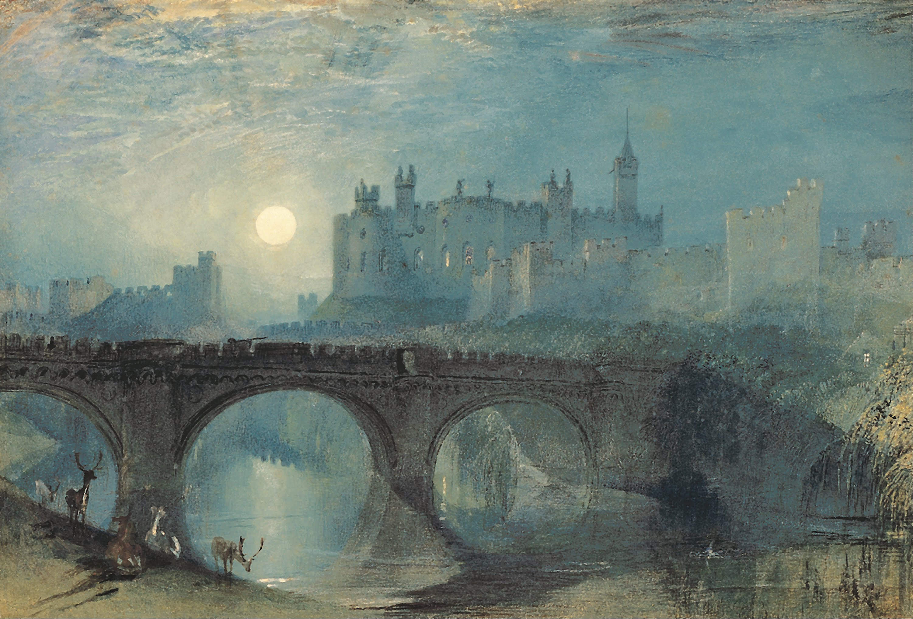

[🏠 Home](../../index.md)

# July 11

## 🧑‍🎨 Painting of the day

[William Turner](https://en.wikipedia.org/wiki/J._M._W._Turner) (Romanticism)

<button class="btn btn-success"
onclick=" window.open('https://lens.google.com/uploadbyurl?url=https://iretes.github.io/one-a-day/data/img/William_Turner_2.jpg','_blank')">
Search with Google Lens
</button>

## 🎼 Song of the day

> *I Only Have Eyes for You*
by The Flamingos

 Written by Harry Warren.

Released in April, 1959.

<button class="btn btn-success"
onclick=" window.open('http://www.youtube.com/search?q=I Only Have Eyes for You by The Flamingos','_blank')">
Search on YouTube
</button>

## 🏛️ UNESCO heritage site of the day

> *Sassanid Archaeological Landscape of Fars Region*, Iran (Islamic Republic of)

The eight archaeological sites situated in three geographical areas in the southeast of Fars Province: Firuzabad, Bishapur and Sarvestan. The fortified structures, palaces and city plans date back to the earliest and latest times of the Sassanian Empire, which stretched across the region from 224 to 658 CE. Among these sites is the capital built by the founder of the dynasty, Ardashir Papakan, as well as a city and architectural structures of his successor, Shapur I. The archaeological landscape reflects the optimized utilization of natural topography and bears witness to the influence of Achaemenid and Parthian cultural traditions and of Roman art, which had a significant impact on the architecture of the Islamic era.

<button class="btn btn-success"
onclick=" window.open('http://www.google.com/search?q=Sassanid Archaeological Landscape of Fars Region','_blank')">
Search on Google
</button>

## 🗺️ Place of the day

<iframe
src="https://www.mapcrunch.com"
name="mapcrunch"
width="500"
height="500"
allowTransparency="true"
scrolling="no"
frameborder="0"
>
</iframe>
## 🎨 Color of the day

> *[Dark sky blue](https://en.wikipedia.org/wiki/Sky_blue#Dark_sky_blue)*

&#9632;

## 🌿 Plant of the day

> *rogues gilli flower*

<button class="btn btn-success"
onclick=" window.open('http://www.google.com/search?q=rogues gilli flower','_blank')">
Search on Google
</button>

## 🧑‍🔬 Scientific discovery of the day

> *1913: Henry Moseley: defined atomic number*

<button class="btn btn-success"
onclick=" window.open('http://www.google.com/search?q=1913: Henry Moseley: defined atomic number','_blank')"> 
Search on Google
</button>

## 💭 Philosophical concept of the day

> *[Alief](https://en.wikipedia.org/wiki/Alief_(belief))*

## 🗣️ Saying of the day

> *Sound bite*

A short and easily remembered line, intended by the speaker to be suitable for media repetition.

## 🏳️‍🌈 International day

World Population Day.