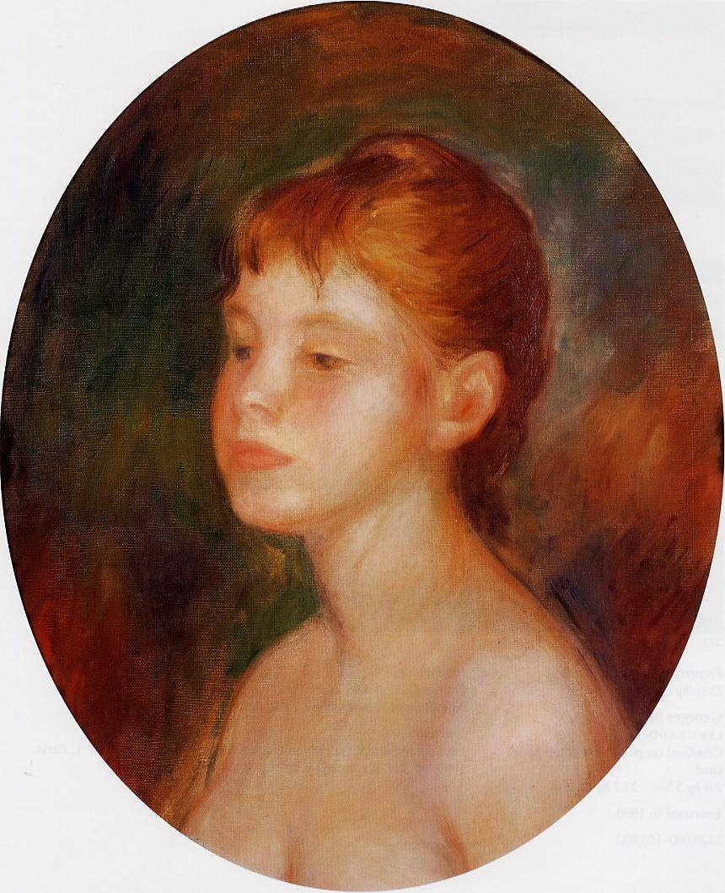

[🏠 Home](../../index.md)

# July 12

## 🧑‍🎨 Painting of the day

[Pierre-Auguste Renoir](http://en.wikipedia.org/wiki/Pierre-Auguste_Renoir) (Impressionism)

<button class="btn btn-success"
onclick=" window.open('https://lens.google.com/uploadbyurl?url=https://iretes.github.io/one-a-day/data/img/Pierre-Auguste_Renoir_6.jpg','_blank')">
Search with Google Lens
</button>

## 🎼 Song of the day

> *The Sounds of Silence*
by Simon and Garfunkel

 Written by Paul Simon.

Released in Nov, 1965.

<button class="btn btn-success"
onclick=" window.open('http://www.youtube.com/search?q=The Sounds of Silence by Simon and Garfunkel','_blank')">
Search on YouTube
</button>

## 🏛️ UNESCO heritage site of the day

> *Al-Ahsa Oasis, an Evolving Cultural Landscape*, Saudi Arabia

In the eastern Arabian Peninsula, the Al-Ahsa Oasis is a serial property comprising gardens, canals, springs, wells and a drainage lake, as well as historical buildings, urban fabric and archaeological sites. They represent traces of continued human settlement in the Gulf region from the Neolithic to the present, as can be seen from remaining historic fortresses, mosques, wells, canals and other water management systems. With its 2.5 million date palms, it is the largest oasis in the world. Al-Ahsa is also a unique geocultural landscape and an exceptional example of human interaction with the environment.

<button class="btn btn-success"
onclick=" window.open('http://www.google.com/search?q=Al-Ahsa Oasis, an Evolving Cultural Landscape','_blank')">
Search on Google
</button>

## 🗺️ Place of the day

<iframe
src="https://www.mapcrunch.com"
name="mapcrunch"
width="500"
height="500"
allowTransparency="true"
scrolling="no"
frameborder="0"
>
</iframe>
## 🎨 Color of the day

> *[Antique bronze](https://en.wikipedia.org/wiki/Antique_bronze)*

&#9632;

## 🌿 Plant of the day

> *lilac*

<button class="btn btn-success"
onclick=" window.open('http://www.google.com/search?q=lilac','_blank')">
Search on Google
</button>

## 🧑‍🔬 Scientific discovery of the day

> *16th century: Gerolamo Cardano solves the general cubic equation (by reducing them to the case with zero quadratic term).*

<button class="btn btn-success"
onclick=" window.open('http://www.google.com/search?q=16th century: Gerolamo Cardano solves the general cubic equation (by reducing them to the case with zero quadratic term).','_blank')">
Search on Google
</button>

## 💭 Philosophical concept of the day

> *[Absolute time and space](https://en.wikipedia.org/wiki/Absolute_time_and_space)*

## 🗣️ Saying of the day

> *Biblical phrases*

The King James Version of the Bible has been enormously influential in the development of the English language. It ranks with the complete works of Shakespeare and the Oxford English Dictionary as one of the cornerstones of the recorded language. After Shakespeare, the King James, or Authorized, Version of the Bible is the most common source of phrases in English. The King James in question was James I of England and James VI of Scotland. He didn't write the text of course, he merely authorized it, hence the name by which the book is best known in the UK (King James Version, or KJV, being more commonly used in the USA).

## 🏳️‍🌈 International day

International Day of Combating Sand and Dust Storms.