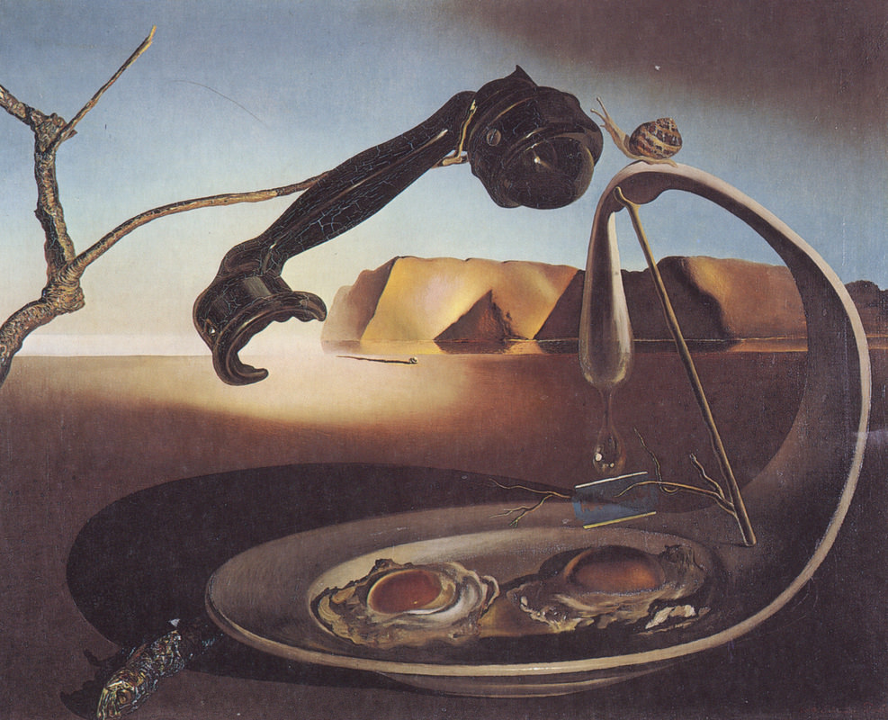

[🏠 Home](../../index.md)

# July 13

## 🧑‍🎨 Painting of the day

[Salvador Dali](http://en.wikipedia.org/wiki/Salvador_Dalí) (Surrealism)

<button class="btn btn-success"
onclick=" window.open('https://lens.google.com/uploadbyurl?url=https://iretes.github.io/one-a-day/data/img/Salvador_Dali_5.jpg','_blank')">
Search with Google Lens
</button>

## 🎼 Song of the day

> *Proud Mary*
by Creedence Clearwater Revival

 Written by John Fogerty.

Released in Jan, 1969.

<button class="btn btn-success"
onclick=" window.open('http://www.youtube.com/search?q=Proud Mary by Creedence Clearwater Revival','_blank')">
Search on YouTube
</button>

## 🏛️ UNESCO heritage site of the day

> *Ban Chiang Archaeological Site*, Thailand

Ban Chiang is considered the most important prehistoric settlement so far discovered in South-East Asia. It marks an important stage in human cultural, social and technological evolution. The site presents the earliest evidence of farming in the region and of the manufacture and use of metals.

<button class="btn btn-success"
onclick=" window.open('http://www.google.com/search?q=Ban Chiang Archaeological Site','_blank')">
Search on Google
</button>

## 🗺️ Place of the day

<iframe
src="https://www.mapcrunch.com"
name="mapcrunch"
width="500"
height="500"
allowTransparency="true"
scrolling="no"
frameborder="0"
>
</iframe>
## 🎨 Color of the day

> *[Light orange](https://en.wikipedia.org/wiki/Shades_of_orange#Light_orange)*

&#9632;

## 🌿 Plant of the day

> *sugarplum*

<button class="btn btn-success"
onclick=" window.open('http://www.google.com/search?q=sugarplum','_blank')">
Search on Google
</button>

## 🧑‍🔬 Scientific discovery of the day

> *1290: Eyeglasses are invented in Northern Italy, possibly Pisa, demonstrating knowledge of human biology and optics, to offer bespoke works that compensate for an individual human disability.*

<button class="btn btn-success"
onclick=" window.open('http://www.google.com/search?q=1290: Eyeglasses are invented in Northern Italy, possibly Pisa, demonstrating knowledge of human biology and optics, to offer bespoke works that compensate for an individual human disability.','_blank')">
Search on Google
</button>

## 💭 Philosophical concept of the day

> *[Civic virtue](https://en.wikipedia.org/wiki/Civic_virtue)*

## 🗣️ Saying of the day

> *Actions speak louder than words*

This proverb express the idea that a person's actions are a better indication of their character than what he or she says.
