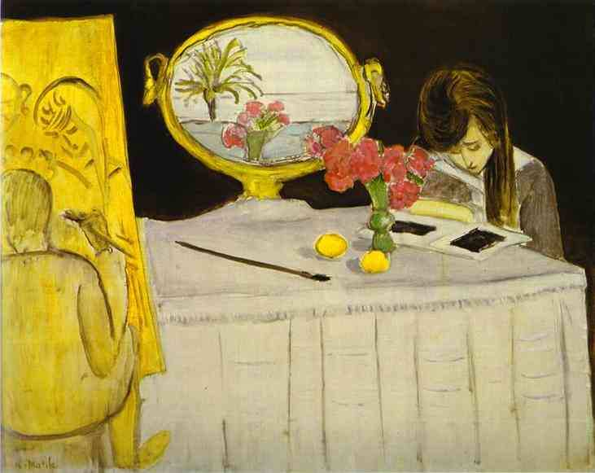

[🏠 Home](../../index.md)

# July 14

## 🧑‍🎨 Painting of the day

[Henri Matisse](http://en.wikipedia.org/wiki/Henri_Matisse) (Impressionism, Post-Impressionism)

<button class="btn btn-success"
onclick=" window.open('https://lens.google.com/uploadbyurl?url=https://iretes.github.io/one-a-day/data/img/Henri_Matisse_3.jpg','_blank')">
Search with Google Lens
</button>

## 🎼 Song of the day

> *Rave On*
by Buddy Holly and the Crickets

 Written by Sonny West, Bill Tilghman, Norman Petty.

Released in April, 1958.

<button class="btn btn-success"
onclick=" window.open('http://www.youtube.com/search?q=Rave On by Buddy Holly and the Crickets','_blank')">
Search on YouTube
</button>

## 🏛️ UNESCO heritage site of the day

> *Olympic National Park*, United States of America

Located in the north-west of Washington State, Olympic National Park is renowned for the diversity of its ecosystems. Glacier-clad peaks interspersed with extensive alpine meadows are surrounded by an extensive old growth forest, among which is the best example of intact and protected temperate rainforest in the Pacific Northwest. Eleven major river systems drain the Olympic mountains, offering some of the best habitat for anadromous fish species in the country. The park also includes 100 km of wilderness coastline, the longest undeveloped coast in the contiguous United States, and is rich in native and endemic animal and plant species, including critical populations of the endangered northern spotted owl, marbled murrelet and bull trout.

<button class="btn btn-success"
onclick=" window.open('http://www.google.com/search?q=Olympic National Park','_blank')">
Search on Google
</button>

## 🗺️ Place of the day

<iframe
src="https://www.mapcrunch.com"
name="mapcrunch"
width="500"
height="500"
allowTransparency="true"
scrolling="no"
frameborder="0"
>
</iframe>
## 🎨 Color of the day

> *[Umber](https://en.wikipedia.org/wiki/Umber)*

&#9632;

## 🌿 Plant of the day

> *spice birch*

<button class="btn btn-success"
onclick=" window.open('http://www.google.com/search?q=spice birch','_blank')">
Search on Google
</button>

## 🧑‍🔬 Scientific discovery of the day

> *3rd century BC: Archimedes develops the field of statics, introducing notions such as the center of gravity, mechanical equilibrium, the study of levers, and hydrostatics.*

<button class="btn btn-success"
onclick=" window.open('http://www.google.com/search?q=3rd century BC: Archimedes develops the field of statics, introducing notions such as the center of gravity, mechanical equilibrium, the study of levers, and hydrostatics.','_blank')">
Search on Google
</button>

## 💭 Philosophical concept of the day

> *[Avatar](https://en.wikipedia.org/wiki/Avatar)*

## 🗣️ Saying of the day

> *Heavens to Betsy*

A mild exclamation of surprise. 
