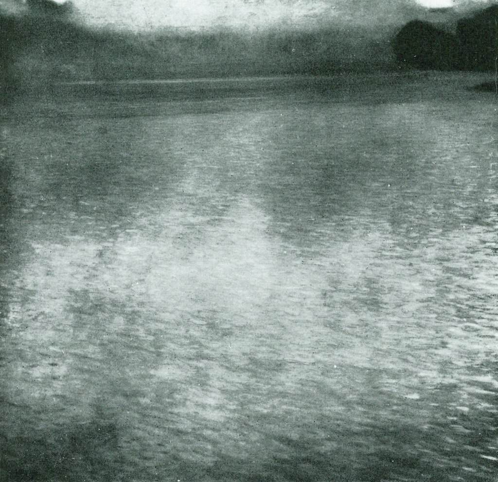

[🏠 Home](../../index.md)

# July 15

## 🧑‍🎨 Painting of the day

[Gustav Klimt](http://en.wikipedia.org/wiki/Gustav_Klimt) (Symbolism, Art Nouveau)

<button class="btn btn-success"
onclick=" window.open('https://lens.google.com/uploadbyurl?url=https://iretes.github.io/one-a-day/data/img/Gustav_Klimt_8.jpg','_blank')">
Search with Google Lens
</button>

## 🎼 Song of the day

> *A Hard Days Night*
by The Beatles

 Written by John Lennon, Paul McCartney.

Released in July, 1964.

<button class="btn btn-success"
onclick=" window.open('http://www.youtube.com/search?q=A Hard Days Night by The Beatles','_blank')">
Search on YouTube
</button>

## 🏛️ UNESCO heritage site of the day

> *Gamzigrad-Romuliana, Palace of Galerius*, Serbia

The Late Roman fortified palace compound and memorial complex of Gamzigrad-Romuliana, Palace of Galerius, in the east of Serbia, was commissioned by Emperor Caius Valerius Galerius Maximianus, in the late 3rd and early 4th centuries. It was known as Felix Romuliana, named after the emperor&rsquo;s mother. The site consists of fortifications, the palace in the north-western part of the complex, basilicas, temples, hot baths, memorial complex, and a tetrapylon. The group of buildings is also unique in its intertwining of ceremonial and memorial functions.

<button class="btn btn-success"
onclick=" window.open('http://www.google.com/search?q=Gamzigrad-Romuliana, Palace of Galerius','_blank')">
Search on Google
</button>

## 🗺️ Place of the day

<iframe
src="https://www.mapcrunch.com"
name="mapcrunch"
width="500"
height="500"
allowTransparency="true"
scrolling="no"
frameborder="0"
>
</iframe>
## 🎨 Color of the day

> *[Rich black (FOGRA39)](https://en.wikipedia.org/wiki/Rich_black)*

&#9632;

## 🌿 Plant of the day

> *bay*

<button class="btn btn-success"
onclick=" window.open('http://www.google.com/search?q=bay','_blank')">
Search on Google
</button>

## 🧑‍🔬 Scientific discovery of the day

> *1983: Kary Mullis invents the polymerase chain reaction, a key discovery in molecular biology*

<button class="btn btn-success"
onclick=" window.open('http://www.google.com/search?q=1983: Kary Mullis invents the polymerase chain reaction, a key discovery in molecular biology','_blank')">
Search on Google
</button>

## 💭 Philosophical concept of the day

> *[Qualia](https://en.wikipedia.org/wiki/Qualia)*

## 🗣️ Saying of the day

> *Face that launched a thousand ships - The *

A reference to the mythological figure Helen of Troy (or some would say, to Aphrodite). Her abduction by Paris was said to be the reason for a fleet of a thousand ships to be launched into battle, initiating the Trojan Wars.

## 🏳️‍🌈 International day

World Youth Skills Day.