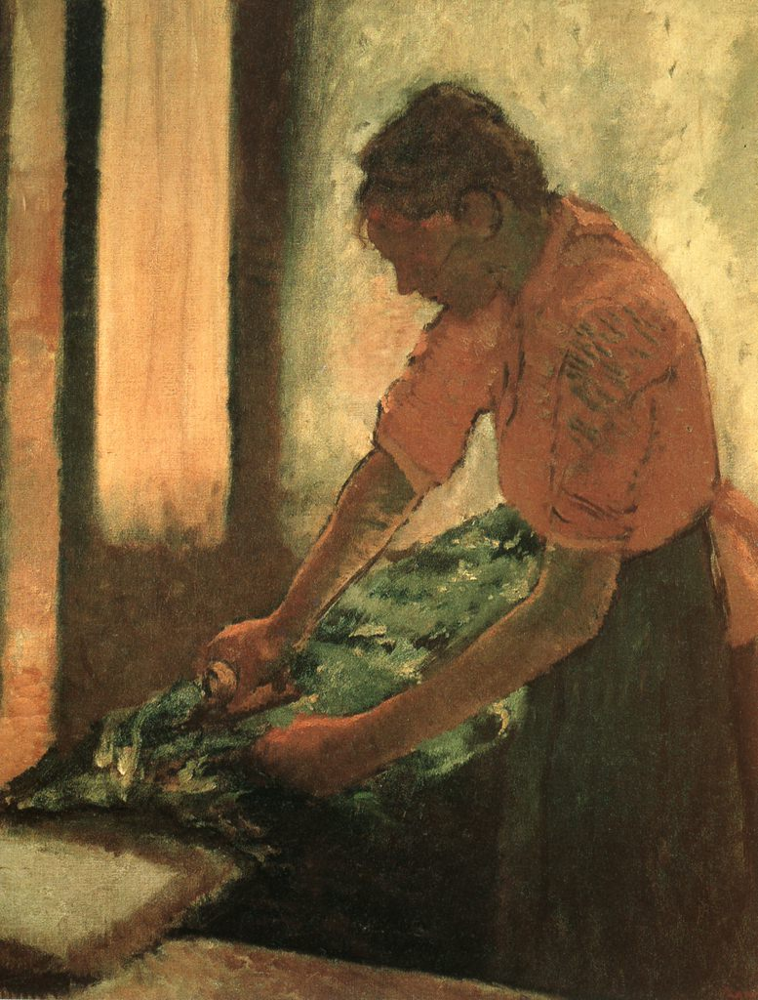

[🏠 Home](../../index.md)

# July 16

## 🧑‍🎨 Painting of the day

[Edgar Degas](http://en.wikipedia.org/wiki/Edgar_Degas) (Impressionism)

<button class="btn btn-success"
onclick=" window.open('https://lens.google.com/uploadbyurl?url=https://iretes.github.io/one-a-day/data/img/Edgar_Degas_5.jpg','_blank')">
Search with Google Lens
</button>

## 🎼 Song of the day

> *Foxey Lady*
by The Jimi Hendrix Experience

 Written by Hendrix.

Released in Aug, 1965.

<button class="btn btn-success"
onclick=" window.open('http://www.youtube.com/search?q=Foxey Lady by The Jimi Hendrix Experience','_blank')">
Search on YouTube
</button>

## 🏛️ UNESCO heritage site of the day

> *Site of Palmyra*, Syrian Arab Republic

An oasis in the Syrian desert, north-east of Damascus, Palmyra contains the monumental ruins of a great city that was one of the most important cultural centres of the ancient world. From the 1st to the 2nd century, the art and architecture of Palmyra, standing at the crossroads of several civilizations, married Graeco-Roman techniques with local traditions and Persian influences.

<button class="btn btn-success"
onclick=" window.open('http://www.google.com/search?q=Site of Palmyra','_blank')">
Search on Google
</button>

## 🗺️ Place of the day

<iframe
src="https://www.mapcrunch.com"
name="mapcrunch"
width="500"
height="500"
allowTransparency="true"
scrolling="no"
frameborder="0"
>
</iframe>
## 🎨 Color of the day

> *[Middle grey](https://en.wikipedia.org/wiki/History_of_Crayola_crayons#Munsell_Crayola,_1926–1944)*

&#9632;

## 🌿 Plant of the day

> *belle isle cress*

<button class="btn btn-success"
onclick=" window.open('http://www.google.com/search?q=belle isle cress','_blank')">
Search on Google
</button>

## 🧑‍🔬 Scientific discovery of the day

> *Late 16th century: Tycho Brahe proves that comets are astronomical (and not atmospheric) phenomena.*

<button class="btn btn-success"
onclick=" window.open('http://www.google.com/search?q=Late 16th century: Tycho Brahe proves that comets are astronomical (and not atmospheric) phenomena.','_blank')">
Search on Google
</button>

## 💭 Philosophical concept of the day

> *[Pratyabhijna](https://en.wikipedia.org/wiki/Pratyabhijna)*

## 🗣️ Saying of the day

> *If wishes were horses, beggars would ride*

This proverb is recorded in English from quite an early date. A version of the expression appeared in the published works of William Camden in the  17th century. Camden was an interesting character; a historian and one of the select few who could write 'Herald' as his job description. He was one of three    senior heralds of the College of Arms under Queen Elizabeth I. In 1605, Camden collected together his miscellaneous notes on English and Classic history and published them under the title  The Remaines of a Greater Worke Concerning Britain. He didn't put his name to the work and dismissed it as "the rude rubble and out-cast rubbish… of a greater and more serious worke". The book was republished in several versions and  included this proverb:
