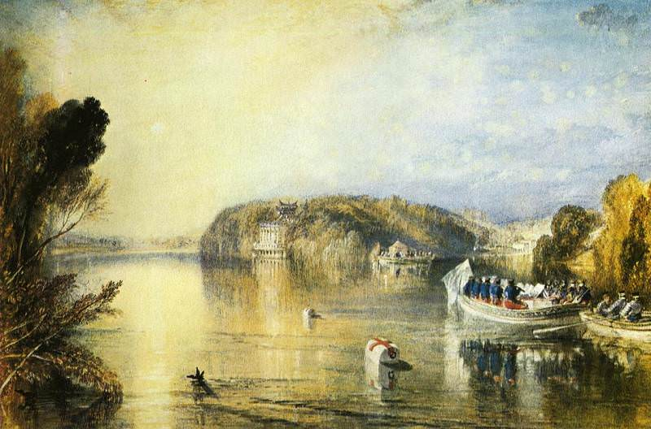

[🏠 Home](../../index.md)

# July 20

## 🧑‍🎨 Painting of the day

[William Turner](https://en.wikipedia.org/wiki/J._M._W._Turner) (Romanticism)

<button class="btn btn-success"
onclick=" window.open('https://lens.google.com/uploadbyurl?url=https://iretes.github.io/one-a-day/data/img/William_Turner_8.jpg','_blank')">
Search with Google Lens
</button>

## 🎼 Song of the day

> *The Night They Drove Old Dixie Down*
by The Band

 Written by Robbie Robertson.

Released in Sept, 1969.

<button class="btn btn-success"
onclick=" window.open('http://www.youtube.com/search?q=The Night They Drove Old Dixie Down by The Band','_blank')">
Search on YouTube
</button>

## 🏛️ UNESCO heritage site of the day

> *Historic Centre of Macao*, China

Macao, a lucrative port of strategic importance in the development of international trade, was under Portuguese administration from the mid-16th century until 1999, when it came under Chinese sovereignty. With its historic street, residential, religious and public Portuguese and Chinese buildings, the historic centre of Macao provides a unique testimony to the meeting of aesthetic, cultural, architectural and technological influences from East and West. The site also contains a fortress and a lighthouse, the oldest in China. It bears witness to one of the earliest and longest-lasting encounters between China and the West, based on the vibrancy of international trade.

<button class="btn btn-success"
onclick=" window.open('http://www.google.com/search?q=Historic Centre of Macao','_blank')">
Search on Google
</button>

## 🗺️ Place of the day

<iframe
src="https://www.mapcrunch.com"
name="mapcrunch"
width="500"
height="500"
allowTransparency="true"
scrolling="no"
frameborder="0"
>
</iframe>
## 🎨 Color of the day

> *[French fuchsia](https://en.wikipedia.org/wiki/Fuchsia_(color)#French_fuchsia)*

&#9632;

## 🌿 Plant of the day

> *pin oak*

<button class="btn btn-success"
onclick=" window.open('http://www.google.com/search?q=pin oak','_blank')">
Search on Google
</button>

## 🧑‍🔬 Scientific discovery of the day

> *499: Aryabhata develops an algorithm to solve the Chinese remainder theorem.*

<button class="btn btn-success"
onclick=" window.open('http://www.google.com/search?q=499: Aryabhata develops an algorithm to solve the Chinese remainder theorem.','_blank')"> 
Search on Google
</button>

## 💭 Philosophical concept of the day

> *[Obligation](https://en.wikipedia.org/wiki/Obligation)*

## 🗣️ Saying of the day

> *Lark about*

Play the fool, in a childish or careless manner.

## 🏳️‍🌈 International day

International Moon Day, World Chess Day.