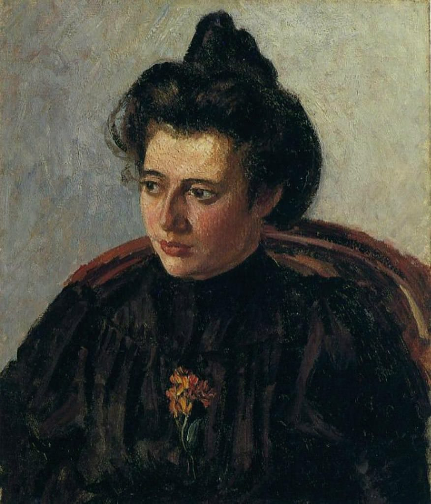

[🏠 Home](../../index.md)

# July 21

## 🧑‍🎨 Painting of the day

[Camille Pissarro](https://en.wikipedia.org/wiki/Camille_Pissarro) (Impressionism, Post-Impressionism)

<button class="btn btn-success"
onclick=" window.open('https://lens.google.com/uploadbyurl?url=https://iretes.github.io/one-a-day/data/img/Camille_Pissarro_4.jpg','_blank')">
Search with Google Lens
</button>

## 🎼 Song of the day

> *(Your Love Keeps Lifting Me) Higher and Higher*
by Jackie Wilson

 Written by Gary Jackson, Raynard Miner, Carl Smith.

Released in Aug, 1967.

<button class="btn btn-success"
onclick=" window.open('http://www.youtube.com/search?q=(Your Love Keeps Lifting Me) Higher and Higher by Jackie Wilson','_blank')">
Search on YouTube
</button>

## 🏛️ UNESCO heritage site of the day

> *<i>Aflaj</i> Irrigation Systems of Oman*, Oman

The property includes five <em>aflaj</em> irrigation systems and is representative of some 3,000 such systems still in use in Oman. The origins of this system of irrigation may date back to AD 500, but archaeological evidence suggests that irrigation systems existed in this extremely arid area as early as 2500 BC. Using gravity, water is channelled from underground sources or springs to support agriculture and domestic use. The fair and effective management and sharing of water in villages and towns is still underpinned by mutual dependence and communal values and guided by astronomical observations. Numerous watchtowers built to defend the water systems form part of the site reflecting the historic dependence of communities on the <em>aflaj</em> system. Threatened by falling level of the underground water table, the <em>aflaj</em> represent an exceptionally well-preserved form of land use.

<button class="btn btn-success"
onclick=" window.open('http://www.google.com/search?q=<i>Aflaj</i> Irrigation Systems of Oman','_blank')">
Search on Google
</button>

## 🗺️ Place of the day

<iframe
src="https://www.mapcrunch.com"
name="mapcrunch"
width="500"
height="500"
allowTransparency="true"
scrolling="no"
frameborder="0"
>
</iframe>
## 🎨 Color of the day

> *[Red (RYB)](https://en.wikipedia.org/wiki/RYB_color_model)*

&#9632;

## 🌿 Plant of the day

> *walnut*

<button class="btn btn-success"
onclick=" window.open('http://www.google.com/search?q=walnut','_blank')">
Search on Google
</button>

## 🧑‍🔬 Scientific discovery of the day

> *2000: The Tau neutrino is discovered by the DONUT collaboration*

<button class="btn btn-success"
onclick=" window.open('http://www.google.com/search?q=2000: The Tau neutrino is discovered by the DONUT collaboration','_blank')">
Search on Google
</button>

## 💭 Philosophical concept of the day

> *[Marx's theory of alienation](https://en.wikipedia.org/wiki/Marx%27s_theory_of_alienation)*

## 🗣️ Saying of the day

> *Say cheese*

A photographer's instruction just before taking a picture, in order to make people smile.
