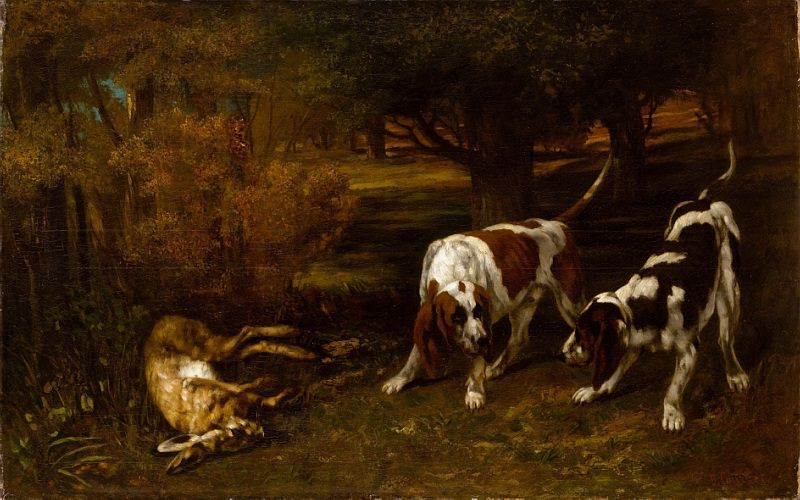

[🏠 Home](../../index.md)

# July 22

## 🧑‍🎨 Painting of the day

[Gustave Courbet](https://en.wikipedia.org/wiki/Gustave_Courbet) (Realism)

<button class="btn btn-success"
onclick=" window.open('https://lens.google.com/uploadbyurl?url=https://iretes.github.io/one-a-day/data/img/Gustave_Courbet_7.jpg','_blank')">
Search with Google Lens
</button>

## 🎼 Song of the day

> *Gimme Some Lovin*
by The Spencer Davis Group

 Written by Davis, Steve Winwood, Muff Winwood.

Released in Dec, 1966.

<button class="btn btn-success"
onclick=" window.open('http://www.youtube.com/search?q=Gimme Some Lovin by The Spencer Davis Group','_blank')">
Search on YouTube
</button>

## 🏛️ UNESCO heritage site of the day

> *Historic Centre of Camagüey*, Cuba

One of the first seven villages founded by the Spaniards in Cuba, Camag&uuml;ey played a prominent role as the urban centre of an inland territory dedicated to cattle breeding and the sugar industry. Settled in its current location in 1528, the town developed on the basis of an irregular urban pattern that contains a system of large and minor squares, serpentine streets, alleys and irregular urban blocks, highly exceptional for Latin American colonial towns located in plain territories. The 54 ha Historic Centre of Camag&uuml;ey constitutes an exceptional example of a traditional urban settlement relatively isolated from main trade routes. The Spanish colonizers followed medieval European influences in terms of urban layout and traditional construction techniques brought to the Americas by their masons and construction masters. The property reflects the influence of numerous styles through the ages: neoclassical, eclectic, Art Deco, Neo-colonial as well as some Art Nouveau and rationalism.

<button class="btn btn-success"
onclick=" window.open('http://www.google.com/search?q=Historic Centre of Camagüey','_blank')">
Search on Google
</button>

## 🗺️ Place of the day

<iframe
src="https://www.mapcrunch.com"
name="mapcrunch"
width="500"
height="500"
allowTransparency="true"
scrolling="no"
frameborder="0"
>
</iframe>
## 🎨 Color of the day

> *[Copper rose](https://en.wikipedia.org/wiki/Copper_(color)#Copper_rose)*

&#9632;

## 🌿 Plant of the day

> *field sow thistle*

<button class="btn btn-success"
onclick=" window.open('http://www.google.com/search?q=field sow thistle','_blank')">
Search on Google
</button>

## 🧑‍🔬 Scientific discovery of the day

> *1500: Nilakantha Somayaji discovers an infinite series for π.*

<button class="btn btn-success"
onclick=" window.open('http://www.google.com/search?q=1500: Nilakantha Somayaji discovers an infinite series for π.','_blank')"> 
Search on Google
</button>

## 💭 Philosophical concept of the day

> *[Beauty](https://en.wikipedia.org/wiki/Beauty)*

## 🗣️ Saying of the day

> *Truth is stranger than fiction*

Literal meaning. 
