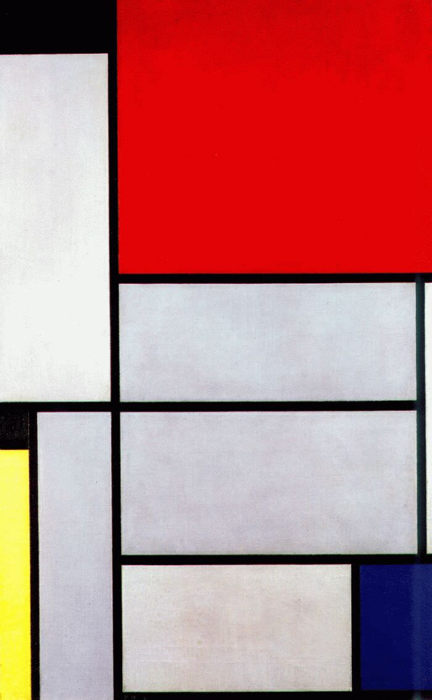

[🏠 Home](../../index.md)

# July 24

## 🧑‍🎨 Painting of the day

[Piet Mondrian](https://en.wikipedia.org/wiki/Piet_Mondrian) (Neoplasticism)

<button class="btn btn-success"
onclick=" window.open('https://lens.google.com/uploadbyurl?url=https://iretes.github.io/one-a-day/data/img/Piet_Mondrian_1.jpg','_blank')">
Search with Google Lens
</button>

## 🎼 Song of the day

> *Rocket Man*
by Elton John

 Written by John, Bernie Taupin.

Released in May, 1972.

<button class="btn btn-success"
onclick=" window.open('http://www.youtube.com/search?q=Rocket Man by Elton John','_blank')">
Search on YouTube
</button>

## 🏛️ UNESCO heritage site of the day

> *Kilimanjaro National Park*, United Republic of Tanzania

At 5,895 m, Kilimanjaro is the highest point in Africa. This volcanic massif stands in splendid isolation above the surrounding plains, with its snowy peak looming over the savannah. The mountain is encircled by mountain forest. Numerous mammals, many of them endangered species, live in the park.

<button class="btn btn-success"
onclick=" window.open('http://www.google.com/search?q=Kilimanjaro National Park','_blank')">
Search on Google
</button>

## 🗺️ Place of the day

<iframe
src="https://www.mapcrunch.com"
name="mapcrunch"
width="500"
height="500"
allowTransparency="true"
scrolling="no"
frameborder="0"
>
</iframe>
## 🎨 Color of the day

> *[English violet](https://en.wikipedia.org/wiki/Shades_of_violet#English_violet)*

&#9632;

## 🌿 Plant of the day

> *true cinnamon*

<button class="btn btn-success"
onclick=" window.open('http://www.google.com/search?q=true cinnamon','_blank')">
Search on Google
</button>

## 🧑‍🔬 Scientific discovery of the day

> *1665: Philosophical Transactions of the Royal Society: first peer reviewed scientific journal published.*

<button class="btn btn-success"
onclick=" window.open('http://www.google.com/search?q=1665: Philosophical Transactions of the Royal Society: first peer reviewed scientific journal published.','_blank')">
Search on Google
</button>

## 💭 Philosophical concept of the day

> *[Virtual](https://en.wikipedia.org/wiki/Virtual_(philosophy))*

## 🗣️ Saying of the day

> *All at sea*

In a state of confusion and disorder. 
