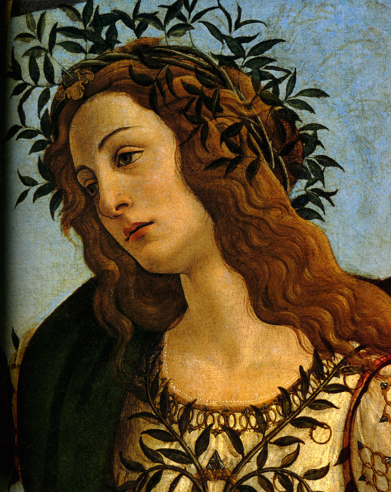

[🏠 Home](../../index.md)

# July 27

## 🧑‍🎨 Painting of the day

[Sandro Botticelli](http://en.wikipedia.org/wiki/Sandro_Botticelli) (Early Renaissance)

<button class="btn btn-success"
onclick=" window.open('https://lens.google.com/uploadbyurl?url=https://iretes.github.io/one-a-day/data/img/Sandro_Botticelli_4.jpg','_blank')">
Search with Google Lens
</button>

## 🎼 Song of the day

> *Son of a Preacher Man*
by Dusty Springfield

 Written by John Hurley, Ronnie Wilkins.

Released in Nov, 1968.

<button class="btn btn-success"
onclick=" window.open('http://www.youtube.com/search?q=Son of a Preacher Man by Dusty Springfield','_blank')">
Search on YouTube
</button>

## 🏛️ UNESCO heritage site of the day

> *Stoclet House*, Belgium

When banker and art collector Adolphe Stoclet commissioned this house from one of the leading architects of the Vienna Secession movement, Josef Hoffmann, in 1905, he imposed neither aesthetic nor financial restrictions on the project. The house and garden were completed in 1911 and their austere geometry marked a turning point in Art Nouveau, foreshadowing Art Deco and the Modern Movement in architecture. Stoclet House is one of the most accomplished and homogenous buildings of the Vienna Secession, and features works by Koloman Moser and Gustav Klimt, embodying the aspiration of creating a &lsquo;total work of art' (Gesamtkunstwerk). Bearing testimony to artistic renewal in European architecture, the house retains a high level of integrity, both externally and internally as it retains most of its original fixtures and furnishings.

<button class="btn btn-success"
onclick=" window.open('http://www.google.com/search?q=Stoclet House','_blank')">
Search on Google
</button>

## 🗺️ Place of the day

<iframe
src="https://www.mapcrunch.com"
name="mapcrunch"
width="500"
height="500"
allowTransparency="true"
scrolling="no"
frameborder="0"
>
</iframe>
## 🎨 Color of the day

> *[Royal purple](https://en.wikipedia.org/wiki/Shades_of_purple#Royal_purple:_17th_century)*

&#9632;

## 🌿 Plant of the day

> *florida dogwood*

<button class="btn btn-success"
onclick=" window.open('http://www.google.com/search?q=florida dogwood','_blank')">
Search on Google
</button>

## 🧑‍🔬 Scientific discovery of the day

> *1838: Matthias Schleiden: all plants are made of cells.*

<button class="btn btn-success"
onclick=" window.open('http://www.google.com/search?q=1838: Matthias Schleiden: all plants are made of cells.','_blank')"> 
Search on Google
</button>

## 💭 Philosophical concept of the day

> *[Paradox](https://en.wikipedia.org/wiki/Paradox)*

## 🗣️ Saying of the day

> *Shoot through*

To abscond, or depart quickly.
