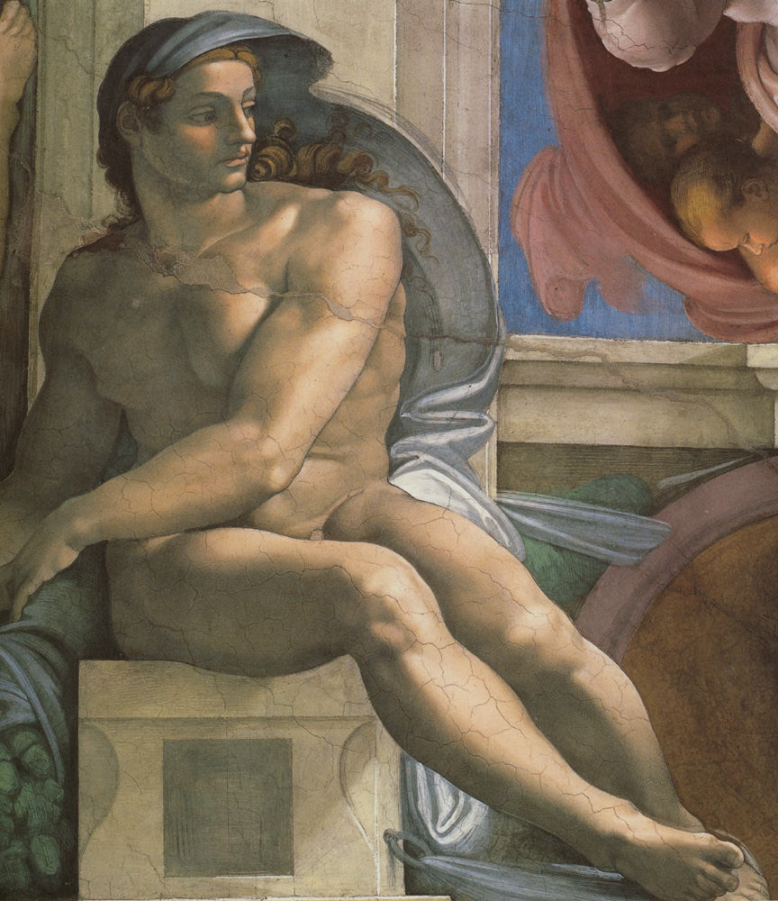

[🏠 Home](../../index.md)

# July 3

## 🧑‍🎨 Painting of the day

[Michelangelo](https://en.wikipedia.org/wiki/Michelangelo) (High Renaissance)

<button class="btn btn-success"
onclick=" window.open('https://lens.google.com/uploadbyurl?url=https://iretes.github.io/one-a-day/data/img/Michelangelo_5.jpg','_blank')">
Search with Google Lens
</button>

## 🎼 Song of the day

> *Bohemian Rhapsody*
by Queen

 Written by Freddie Mercury.

Released in Nov, 1975.

<button class="btn btn-success"
onclick=" window.open('http://www.youtube.com/search?q=Bohemian Rhapsody by Queen','_blank')">
Search on YouTube
</button>

## 🏛️ UNESCO heritage site of the day

> *Old and New Towns of Edinburgh*, United Kingdom of Great Britain and Northern Ireland

Edinburgh has been the Scottish capital since the 15th century. It has two distinct areas: the Old Town, dominated by a medieval fortress; and the neoclassical New Town, whose development from the 18th century onwards had a far-reaching influence on European urban planning. The harmonious juxtaposition of these two contrasting historic areas, each with many important buildings, is what gives the city its unique character.

<button class="btn btn-success"
onclick=" window.open('http://www.google.com/search?q=Old and New Towns of Edinburgh','_blank')">
Search on Google
</button>

## 🗺️ Place of the day

<iframe
src="https://www.mapcrunch.com"
name="mapcrunch"
width="500"
height="500"
allowTransparency="true"
scrolling="no"
frameborder="0"
>
</iframe>
## 🎨 Color of the day

> *[Olivine](https://en.wikipedia.org/wiki/Olive_(color)#Olivine)*

&#9632;

## 🌿 Plant of the day

> *yellow birch*

<button class="btn btn-success"
onclick=" window.open('http://www.google.com/search?q=yellow birch','_blank')">
Search on Google
</button>

## 🧑‍🔬 Scientific discovery of the day

> *12th century: Al-Tusi develops a numerical algorithm to solve cubic equations.*

<button class="btn btn-success"
onclick=" window.open('http://www.google.com/search?q=12th century: Al-Tusi develops a numerical algorithm to solve cubic equations.','_blank')">
Search on Google
</button>

## 💭 Philosophical concept of the day

> *[Discourse](https://en.wikipedia.org/wiki/Discourse)*

## 🗣️ Saying of the day

> *Nip and tuck*

A close result in a race or contest. More recently, the name of a cosmetic surgery procedure. 
