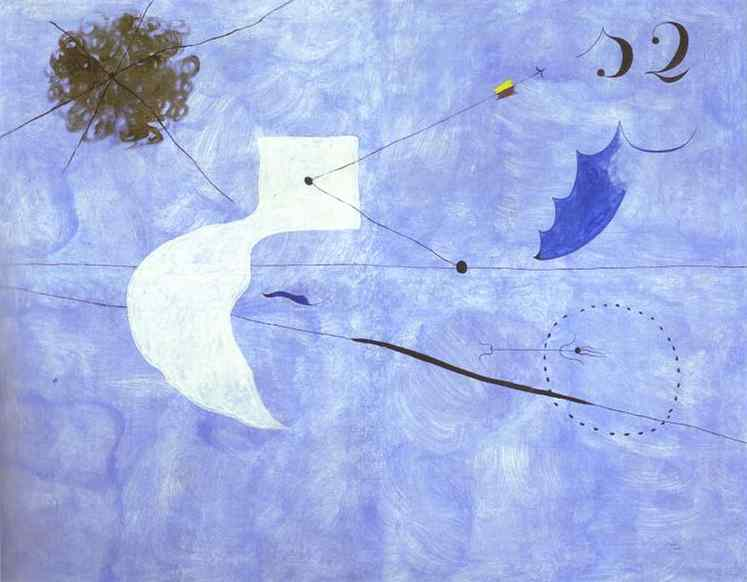

[🏠 Home](../../index.md)

# July 30

## 🧑‍🎨 Painting of the day

[Joan Miro](https://en.wikipedia.org/wiki/Joan_Miró) (Surrealism)

<button class="btn btn-success"
onclick=" window.open('https://lens.google.com/uploadbyurl?url=https://iretes.github.io/one-a-day/data/img/Joan_Miro_2.jpg','_blank')">
Search with Google Lens
</button>

## 🎼 Song of the day

> *I Got a Woman*
by Ray Charles

 Written by Charles, Renald Richard.

Released in Nov, 1954.

<button class="btn btn-success"
onclick=" window.open('http://www.youtube.com/search?q=I Got a Woman by Ray Charles','_blank')">
Search on YouTube
</button>

## 🏛️ UNESCO heritage site of the day

> *Historic Centre (Old Town) of Tallinn*, Estonia

The origins of Tallinn date back to the 13th century, when a castle was built there by the crusading knights of the Teutonic Order. It developed as a major centre of the Hanseatic League, and its wealth is demonstrated by the opulence of the public buildings (the churches in particular) and the domestic architecture of the merchants' houses, which have survived to a remarkable degree despite the ravages of fire and war in the intervening centuries.

<button class="btn btn-success"
onclick=" window.open('http://www.google.com/search?q=Historic Centre (Old Town) of Tallinn','_blank')">
Search on Google
</button>

## 🗺️ Place of the day

<iframe
src="https://www.mapcrunch.com"
name="mapcrunch"
width="500"
height="500"
allowTransparency="true"
scrolling="no"
frameborder="0"
>
</iframe>
## 🎨 Color of the day

> *[Sunset](https://en.wikipedia.org/wiki/Sunset_(color))*

&#9632;

## 🌿 Plant of the day

> *dindle*

<button class="btn btn-success"
onclick=" window.open('http://www.google.com/search?q=dindle','_blank')">
Search on Google
</button>

## 🧑‍🔬 Scientific discovery of the day

> *1755: Immanuel Kant: Gaseous Hypothesis in Universal Natural History and Theory of Heaven.*

<button class="btn btn-success"
onclick=" window.open('http://www.google.com/search?q=1755: Immanuel Kant: Gaseous Hypothesis in Universal Natural History and Theory of Heaven.','_blank')">
Search on Google
</button>

## 💭 Philosophical concept of the day

> *[All men are created equal](https://en.wikipedia.org/wiki/All_men_are_created_equal)*

## 🗣️ Saying of the day

> *Rub of the green*

Luck; especially in sports and pastimes played on a green surface.

## 🏳️‍🌈 International day

International Day of Friendship, World Day against Trafficking in Persons.