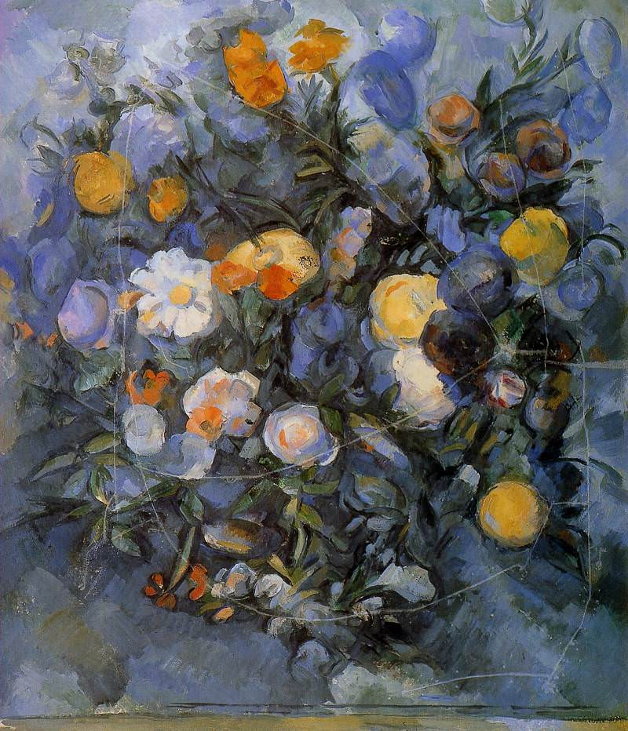

[🏠 Home](../../index.md)

# July 31

## 🧑‍🎨 Painting of the day

[Paul Cezanne](https://en.wikipedia.org/wiki/Paul_Cézanne) (Post-Impressionism)

<button class="btn btn-success"
onclick=" window.open('https://lens.google.com/uploadbyurl?url=https://iretes.github.io/one-a-day/data/img/Paul_Cezanne_7.jpg','_blank')">
Search with Google Lens
</button>

## 🎼 Song of the day

> *Everyday*
by Buddy Holly and the Crickets

 Written by Charles Hardin, Norman Petty.

Released in Sept, 1957.

<button class="btn btn-success"
onclick=" window.open('http://www.youtube.com/search?q=Everyday by Buddy Holly and the Crickets','_blank')">
Search on YouTube
</button>

## 🏛️ UNESCO heritage site of the day

> *Taputapuātea*, France

Taputapuātea on Ra’iātea Island is at the centre of the ‘Polynesian Triangle’, a vast portion of the Pacific Ocean, dotted with islands, and the last part of the globe to be settled by humans. The property includes two forested valleys, a portion of lagoon and coral reef and a strip of open ocean. At the heart of the property is the Taputapuātea <em>marae</em> complex, a political, ceremonial and funerary centre. It is characterized by several marae, with different functions. Widespread in Polynesia, the <em>marae </em>were places where the world of the living intersected the world of the ancestors and the gods. Taputapuātea is an exceptional testimony to 1,000 years of <em>mā'ohi </em>civilization<em>.</em>

<button class="btn btn-success"
onclick=" window.open('http://www.google.com/search?q=Taputapuātea','_blank')">
Search on Google
</button>

## 🗺️ Place of the day

<iframe
src="https://www.mapcrunch.com"
name="mapcrunch"
width="500"
height="500"
allowTransparency="true"
scrolling="no"
frameborder="0"
>
</iframe>
## 🎨 Color of the day

> *[Paradise pink](https://en.wikipedia.org/wiki/Shades_of_pink#Paradise_pink)*

&#9632;

## 🌿 Plant of the day

> *baobab*

<button class="btn btn-success"
onclick=" window.open('http://www.google.com/search?q=baobab','_blank')">
Search on Google
</button>

## 🧑‍🔬 Scientific discovery of the day

> *1763: Thomas Bayes: publishes the first version of Bayes' theorem, paving the way for Bayesian probability.*

<button class="btn btn-success"
onclick=" window.open('http://www.google.com/search?q=1763: Thomas Bayes: publishes the first version of Bayes  theorem, paving the way for Bayesian probability.','_blank')">
Search on Google
</button>

## 💭 Philosophical concept of the day

> *[Perpetual peace](https://en.wikipedia.org/wiki/Perpetual_peace)*

## 🗣️ Saying of the day

> *Shoddy*

Describing  inferior goods or workmanship, or disrespectful behaviour.
