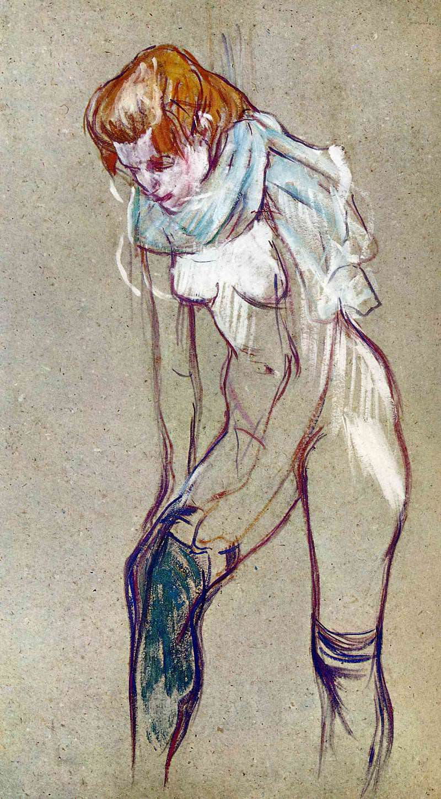

[🏠 Home](../../index.md)

# July 4

## 🧑‍🎨 Painting of the day

[Henri de Toulouse-Lautrec](https://en.wikipedia.org/wiki/Henri_de_Toulouse-Lautrec) (Post-Impressionism)

<button class="btn btn-success"
onclick=" window.open('https://lens.google.com/uploadbyurl?url=https://iretes.github.io/one-a-day/data/img/Henri_de_Toulouse-Lautrec_1.jpg','_blank')">
Search with Google Lens
</button>

## 🎼 Song of the day

> *Nothing Compares 2 U*
by Sinead O'Connor

 Written by Prince.

Released in March, 1990.

<button class="btn btn-success"
onclick=" window.open('http://www.youtube.com/search?q=Nothing Compares 2 U by Sinead O Connor','_blank')">
Search on YouTube
</button>

## 🏛️ UNESCO heritage site of the day

> *Al Qal'a of Beni Hammad*, Algeria

In a mountainous site of extraordinary beauty, the ruins of the first capital of the Hammadid emirs, founded in 1007 and demolished in 1152, provide an authentic picture of a fortified Muslim city. The mosque, whose prayer room has 13 aisles with eight bays, is one of the largest in Algeria.

<button class="btn btn-success"
onclick=" window.open('http://www.google.com/search?q=Al Qal a of Beni Hammad','_blank')">
Search on Google
</button>

## 🗺️ Place of the day

<iframe
src="https://www.mapcrunch.com"
name="mapcrunch"
width="500"
height="500"
allowTransparency="true"
scrolling="no"
frameborder="0"
>
</iframe>
## 🎨 Color of the day

> *[Fiery rose](https://en.wikipedia.org/wiki/List_of_Crayola_crayon_colors#Extreme_Twistables_colors)*

&#9632;

## 🌿 Plant of the day

> *bastard pellitory*

<button class="btn btn-success"
onclick=" window.open('http://www.google.com/search?q=bastard pellitory','_blank')">
Search on Google
</button>

## 🧑‍🔬 Scientific discovery of the day

> *1556: Niccolò Tartaglia introduces parenthesis.*

<button class="btn btn-success"
onclick=" window.open('http://www.google.com/search?q=1556: Niccolò Tartaglia introduces parenthesis.','_blank')"> 
Search on Google
</button>

## 💭 Philosophical concept of the day

> *[Arborescent](https://en.wikipedia.org/wiki/Arborescent)*

## 🗣️ Saying of the day

> *Tawdry*

Showy, but of poor quality.
