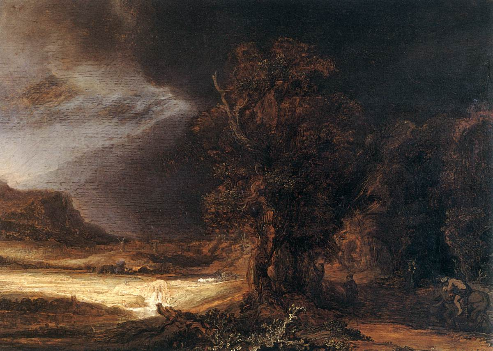

[🏠 Home](../../index.md)

# July 6

## 🧑‍🎨 Painting of the day

[Rembrandt](http://en.wikipedia.org/wiki/Rembrandt) (Baroque)

<button class="btn btn-success"
onclick=" window.open('https://lens.google.com/uploadbyurl?url=https://iretes.github.io/one-a-day/data/img/Rembrandt_2.jpg','_blank')">
Search with Google Lens
</button>

## 🎼 Song of the day

> *Folsom Prison Blues*
by Johnny Cash

 Written by Cash.

Released in Jan, 1956.

<button class="btn btn-success"
onclick=" window.open('http://www.youtube.com/search?q=Folsom Prison Blues by Johnny Cash','_blank')">
Search on YouTube
</button>

## 🏛️ UNESCO heritage site of the day

> *Prehistoric Caves of Yagul and Mitla in the Central Valley of Oaxaca*, Mexico

This property lies on the northern slopes of the Tlacolula valley in subtropical central Oaxaca and consists of two pre-Hispanic archaeological complexes and a series of pre-historic caves and rock shelters. Some of these shelters provide archaeological and rock-art evidence for the progress of nomadic hunter-gathers to incipient farmers. Ten thousand-year-old Cucurbitaceae seeds in one cave, Guil&aacute; Naquitz, are considered to be the earliest known evidence of domesticated plants in the continent, while corn cob fragments from the same cave are said to be the earliest documented evidence for the domestication of maize. The cultural landscape of the Prehistoric Caves of Yagul and Mitla demonstrates the link between man and nature that gave origin to the domestication of plants in North America, thus allowing the rise of Mesoamerican civilizations.

<button class="btn btn-success"
onclick=" window.open('http://www.google.com/search?q=Prehistoric Caves of Yagul and Mitla in the Central Valley of Oaxaca','_blank')">
Search on Google
</button>

## 🗺️ Place of the day

<iframe
src="https://www.mapcrunch.com"
name="mapcrunch"
width="500"
height="500"
allowTransparency="true"
scrolling="no"
frameborder="0"
>
</iframe>
## 🎨 Color of the day

> *[Upsdell red](https://en.wikipedia.org/wiki/Upsdell_red)*

&#9632;

## 🌿 Plant of the day

> *coast polypody*

<button class="btn btn-success"
onclick=" window.open('http://www.google.com/search?q=coast polypody','_blank')">
Search on Google
</button>

## 🧑‍🔬 Scientific discovery of the day

> *1220s: Robert Grosseteste writes on optics, and the production of lenses, while asserting models should be developed from observations, and predictions of those models verified through observation, in a precursor to the scientific method.*

<button class="btn btn-success"
onclick=" window.open('http://www.google.com/search?q=1220s: Robert Grosseteste writes on optics, and the production of lenses, while asserting models should be developed from observations, and predictions of those models verified through observation, in a precursor to the scientific method.','_blank')"> 
Search on Google
</button>

## 💭 Philosophical concept of the day

> *[State of nature](https://en.wikipedia.org/wiki/State_of_nature)*

## 🗣️ Saying of the day

> *Funny farm*

Mental institution. 

## 🏳️‍🌈 International day

International Day of Cooperatives.