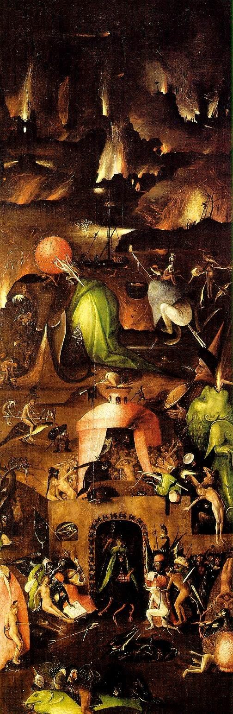

[🏠 Home](../../index.md)

# July 7

## 🧑‍🎨 Painting of the day

[Hieronymus Bosch](http://en.wikipedia.org/wiki/Hieronymus_Bosch) (Northern Renaissance)

<button class="btn btn-success"
onclick=" window.open('https://lens.google.com/uploadbyurl?url=https://iretes.github.io/one-a-day/data/img/Hieronymus_Bosch_7.jpg','_blank')">
Search with Google Lens
</button>

## 🎼 Song of the day

> *Bring the Noise*
by Public Enemy

 Written by Carlton Ridenhour, Eric Sadler, Hank Shocklee.

Released in April, 1988.

<button class="btn btn-success"
onclick=" window.open('http://www.youtube.com/search?q=Bring the Noise by Public Enemy','_blank')">
Search on YouTube
</button>

## 🏛️ UNESCO heritage site of the day

> *Völklingen Ironworks*, Germany

The ironworks, which cover some 6 ha, dominate the city of Völklingen. Although they have recently gone out of production, they are the only intact example, in the whole of western Europe and North America, of an integrated ironworks that was built and equipped in the 19th and 20th centuries and has remained intact.

<button class="btn btn-success"
onclick=" window.open('http://www.google.com/search?q=Völklingen Ironworks','_blank')">
Search on Google
</button>

## 🗺️ Place of the day

<iframe
src="https://www.mapcrunch.com"
name="mapcrunch"
width="500"
height="500"
allowTransparency="true"
scrolling="no"
frameborder="0"
>
</iframe>
## 🎨 Color of the day

> *[Middle red](https://en.wikipedia.org/wiki/History_of_Crayola_crayons#Munsell_Crayola,_1926–1944)*

&#9632;

## 🌿 Plant of the day

> *marsh ragwort*

<button class="btn btn-success"
onclick=" window.open('http://www.google.com/search?q=marsh ragwort','_blank')">
Search on Google
</button>

## 🧑‍🔬 Scientific discovery of the day

> *4th century BC: The first true formal system is constructed by Pāṇini in his Sanskrit grammar.*

<button class="btn btn-success"
onclick=" window.open('http://www.google.com/search?q=4th century BC: The first true formal system is constructed by Pāṇini in his Sanskrit grammar.','_blank')"> 
Search on Google
</button>

## 💭 Philosophical concept of the day

> *[Mental representation](https://en.wikipedia.org/wiki/Mental_representation)*

## 🗣️ Saying of the day

> *Blot on the landscape*

Something
that spoils the view or ruins a previously comfortable situation.

## 🏳️‍🌈 International day

World Kiswahili Language Day.