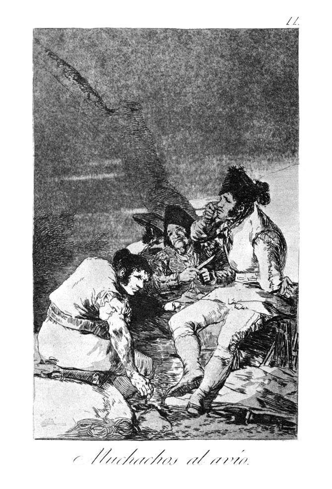

[🏠 Home](../../index.md)

# July 8

## 🧑‍🎨 Painting of the day

[Francisco Goya](http://en.wikipedia.org/wiki/Francisco_Goya) (Romanticism)

<button class="btn btn-success"
onclick=" window.open('https://lens.google.com/uploadbyurl?url=https://iretes.github.io/one-a-day/data/img/Francisco_Goya_1.jpg','_blank')">
Search with Google Lens
</button>

## 🎼 Song of the day

> *Im Waiting for the Man*
by The Velvet Underground

 Written by Lou Reed.

Released in March, 1967.

<button class="btn btn-success"
onclick=" window.open('http://www.youtube.com/search?q=Im Waiting for the Man by The Velvet Underground','_blank')">
Search on YouTube
</button>

## 🏛️ UNESCO heritage site of the day

> *Cultural Landscape and Archaeological Remains of the Bamiyan Valley*, Afghanistan

The cultural landscape and archaeological remains of the Bamiyan Valley represent the artistic and religious developments which from the 1st to the 13th centuries characterized ancient Bakhtria, integrating various cultural influences into the Gandhara school of Buddhist art. The area contains numerous Buddhist monastic ensembles and sanctuaries, as well as fortified edifices from the Islamic period. The site is also testimony to the tragic destruction by the Taliban of the two standing Buddha statues, which shook the world in March 2001.

<button class="btn btn-success"
onclick=" window.open('http://www.google.com/search?q=Cultural Landscape and Archaeological Remains of the Bamiyan Valley','_blank')">
Search on Google
</button>

## 🗺️ Place of the day

<iframe
src="https://www.mapcrunch.com"
name="mapcrunch"
width="500"
height="500"
allowTransparency="true"
scrolling="no"
frameborder="0"
>
</iframe>
## 🎨 Color of the day

> *[Spanish pink](https://en.wikipedia.org/wiki/Shades_of_pink#Spanish_pink)*

&#9632;

## 🌿 Plant of the day

> *bristly ground berry*

<button class="btn btn-success"
onclick=" window.open('http://www.google.com/search?q=bristly ground berry','_blank')">
Search on Google
</button>

## 🧑‍🔬 Scientific discovery of the day

> *10th century AD: Kashmiri astronomer Bhaṭṭotpala lists names and estimates periods of certain comets.*

<button class="btn btn-success"
onclick=" window.open('http://www.google.com/search?q=10th century AD: Kashmiri astronomer Bhaṭṭotpala lists names and estimates periods of certain comets.','_blank')">
Search on Google
</button>

## 💭 Philosophical concept of the day

> *[Sortal](https://en.wikipedia.org/wiki/Sortal)*

## 🗣️ Saying of the day

> *Friends, Romans, Countrymen, lend me your ears*

This quotation from Julius Caesar is one of Shakespeare's best-known lines. Mark Antony delivers a eulogy in honour of the recently murdered Julius Caesar: 
