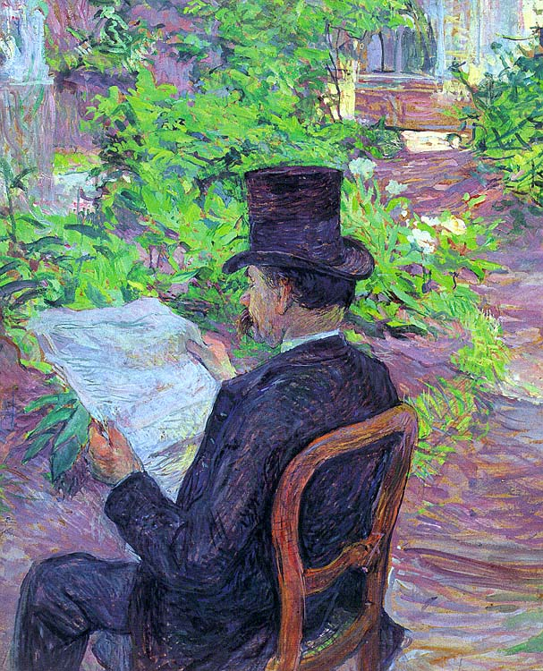

[🏠 Home](../../index.md)

# June 1

## 🧑‍🎨 Painting of the day

[Henri de Toulouse-Lautrec](https://en.wikipedia.org/wiki/Henri_de_Toulouse-Lautrec) (Post-Impressionism)

<button class="btn btn-success"
onclick=" window.open('https://lens.google.com/uploadbyurl?url=https://iretes.github.io/one-a-day/data/img/Henri_de_Toulouse-Lautrec_2.jpg','_blank')">
Search with Google Lens
</button>

## 🎼 Song of the day

> *Sweet Child OMine*
by Guns n' Roses

 Written by Guns n' Roses.

Released in Aug, 1987.

<button class="btn btn-success"
onclick=" window.open('http://www.youtube.com/search?q=Sweet Child OMine by Guns n  Roses','_blank')">
Search on YouTube
</button>

## 🏛️ UNESCO heritage site of the day

> *Taxila*, Pakistan

From the ancient Neolithic tumulus of Saraikala to the ramparts of Sirkap (2nd century B.C.) and the city of Sirsukh (1st century A.D.), Taxila illustrates the different stages in the development of a city on the Indus that was alternately influenced by Persia, Greece and Central Asia and which, from the 5th century B.C. to the 2nd century A.D., was an important Buddhist centre of learning.

<button class="btn btn-success"
onclick=" window.open('http://www.google.com/search?q=Taxila','_blank')">
Search on Google
</button>

## 🗺️ Place of the day

<iframe
src="https://www.mapcrunch.com"
name="mapcrunch"
width="500"
height="500"
allowTransparency="true"
scrolling="no"
frameborder="0"
>
</iframe>
## 🎨 Color of the day

> *[Rifle green](https://en.wikipedia.org/wiki/Shades_of_green#Mint_green)*

&#9632;

## 🌿 Plant of the day

> *nightshade*

<button class="btn btn-success"
onclick=" window.open('http://www.google.com/search?q=nightshade','_blank')">
Search on Google
</button>

## 🧑‍🔬 Scientific discovery of the day

> *1545: Gerolamo Cardano discovers complex numbers.*

<button class="btn btn-success"
onclick=" window.open('http://www.google.com/search?q=1545: Gerolamo Cardano discovers complex numbers.','_blank')">
Search on Google
</button>

## 💭 Philosophical concept of the day

> *[Ideal](https://en.wikipedia.org/wiki/Ideal_(ethics))*

## 🗣️ Saying of the day

> *Give the Devil his due*

Literally, pay the devil what you owe him. Used figuratively to mean 'give back what you owe', either money or favours. 

## 🏳️‍🌈 International day

Global Day of Parents.