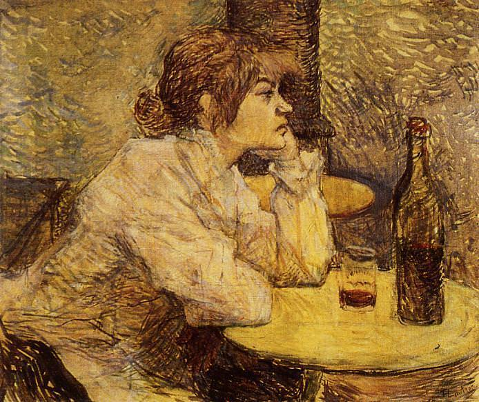

[🏠 Home](../../index.md)

# June 10

## 🧑‍🎨 Painting of the day

[Henri de Toulouse-Lautrec](https://en.wikipedia.org/wiki/Henri_de_Toulouse-Lautrec) (Post-Impressionism)

<button class="btn btn-success"
onclick=" window.open('https://lens.google.com/uploadbyurl?url=https://iretes.github.io/one-a-day/data/img/Henri_de_Toulouse-Lautrec_4.jpg','_blank')">
Search with Google Lens
</button>

## 🎼 Song of the day

> *I Never Loved a Man (the Way I Love You)*
by Aretha Franklin

 Written by Ronny Shannon.

Released in March, 1967.

<button class="btn btn-success"
onclick=" window.open('http://www.youtube.com/search?q=I Never Loved a Man (the Way I Love You) by Aretha Franklin','_blank')">
Search on YouTube
</button>

## 🏛️ UNESCO heritage site of the day

> *The Slate Landscape of Northwest Wales*, United Kingdom of Great Britain and Northern Ireland

The Slate Landscape of Northwest Wales illustrates the transformation that industrial slate quarrying and mining brought about in the traditional rural environment of the mountains and valleys of the Snowdon massif. The territory, extending from mountain-top to sea-coast, presented opportunities and constraints that were used and challenged by the large-scale industrial processes undertaken by landowners and capital investors, which reshaped the agricultural landscape into an industrial centre for slate production during the Industrial Revolution (1780-1914). The serial property comprises six components each encompassing relict quarries and mines, archaeological sites related to slate industrial processing, historical settlements, both living and relict, historic gardens and grand country houses, ports, harbours and quays, and railway and road systems illustrating the functional and social linkages of the relict slate industrial landscape. The property was internationally significant not only for the export of slates, but also for the export of technology and skilled workers from the 1780s to the early 20th century. It played a leading role in the field and constituted a model for other slate quarries in different parts of the world. It offers an important and remarkable example of interchange of materials, technology and human values. 

<button class="btn btn-success"
onclick=" window.open('http://www.google.com/search?q=The Slate Landscape of Northwest Wales','_blank')">
Search on Google
</button>

## 🗺️ Place of the day

<iframe
src="https://www.mapcrunch.com"
name="mapcrunch"
width="500"
height="500"
allowTransparency="true"
scrolling="no"
frameborder="0"
>
</iframe>
## 🎨 Color of the day

> *[Granny Smith apple](https://en.wikipedia.org/wiki/List_of_Crayola_crayon_colors)*

&#9632;

## 🌿 Plant of the day

> *colic weed*

<button class="btn btn-success"
onclick=" window.open('http://www.google.com/search?q=colic weed','_blank')">
Search on Google
</button>

## 🧑‍🔬 Scientific discovery of the day

> *300 BC: Finite geometric progressions are studied by Euclid in Ptolemaic Egypt.*

<button class="btn btn-success"
onclick=" window.open('http://www.google.com/search?q=300 BC: Finite geometric progressions are studied by Euclid in Ptolemaic Egypt.','_blank')">
Search on Google
</button>

## 💭 Philosophical concept of the day

> *[Kala](https://en.wikipedia.org/wiki/K%C4%81la_(time))*

## 🗣️ Saying of the day

> *Take potluck *

Take one's chance as to what meal one is served when accepting another's hospitality. Also, in the USA, potluck is the name of a communal meal, in which participants each bring a dish to be shared. 
