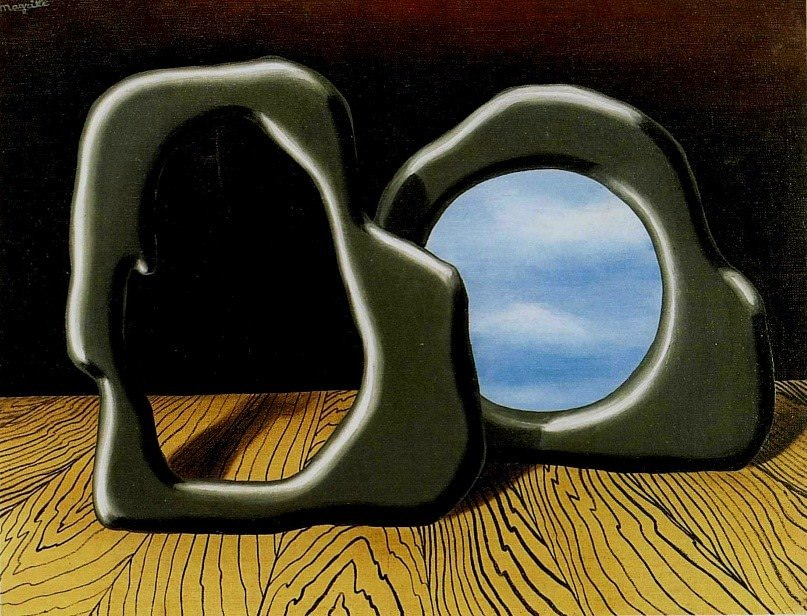

[🏠 Home](../../index.md)

# June 11

## 🧑‍🎨 Painting of the day

[Rene Magritte](http://en.wikipedia.org/wiki/René_Magritte) (Surrealism, Impressionism)

<button class="btn btn-success"
onclick=" window.open('https://lens.google.com/uploadbyurl?url=https://iretes.github.io/one-a-day/data/img/Rene_Magritte_5.jpg','_blank')">
Search with Google Lens
</button>

## 🎼 Song of the day

> *Wholl Stop the Rain*
by Creedence Clearwater Revival

 Written by John Fogerty.

Released in Jan, 1970.

<button class="btn btn-success"
onclick=" window.open('http://www.youtube.com/search?q=Wholl Stop the Rain by Creedence Clearwater Revival','_blank')">
Search on YouTube
</button>

## 🏛️ UNESCO heritage site of the day

> *Sichuan Giant Panda Sanctuaries - Wolong, Mt Siguniang and Jiajin Mountains *, China

Sichuan Giant Panda Sanctuaries, home to more than 30% of the world's pandas which are classed as highly endangered, covers 924,500 ha with seven nature reserves and nine scenic parks in the Qionglai and Jiajin Mountains. The sanctuaries constitute the largest remaining contiguous habitat of the giant panda, a relict from the paleo-tropic forests of the Tertiary Era. It is also the species' most important site for captive breeding. The sanctuaries are home to other globally endangered animals such as the red panda, the snow leopard and clouded leopard. They are among the botanically richest sites of any region in the world outside the tropical rainforests, with between 5,000 and 6,000 species of flora in over 1,000 genera.

<button class="btn btn-success"
onclick=" window.open('http://www.google.com/search?q=Sichuan Giant Panda Sanctuaries - Wolong, Mt Siguniang and Jiajin Mountains ','_blank')">
Search on Google
</button>

## 🗺️ Place of the day

<iframe
src="https://www.mapcrunch.com"
name="mapcrunch"
width="500"
height="500"
allowTransparency="true"
scrolling="no"
frameborder="0"
>
</iframe>
## 🎨 Color of the day

> *[Brown sugar](https://en.wikipedia.org/wiki/List_of_Crayola_crayon_colors#Heads_&#39;n_Tails)*

&#9632;

## 🌿 Plant of the day

> *clove*

<button class="btn btn-success"
onclick=" window.open('http://www.google.com/search?q=clove','_blank')">
Search on Google
</button>

## 🧑‍🔬 Scientific discovery of the day

> *499: Aryabhata discovers the formula for the square-pyramidal numbers (the sums of consecutive square numbers).*

<button class="btn btn-success"
onclick=" window.open('http://www.google.com/search?q=499: Aryabhata discovers the formula for the square-pyramidal numbers (the sums of consecutive square numbers).','_blank')">
Search on Google
</button>

## 💭 Philosophical concept of the day

> *[Yi](https://en.wikipedia.org/wiki/Yi_(Confucianism))*

## 🗣️ Saying of the day

> *Adversity makes strange bedfellows*

The proverbial saying 'adversity makes strange bedfellows' suggests that, in times of trouble, people who wouldn't normally associate with each other may form an alliance.
