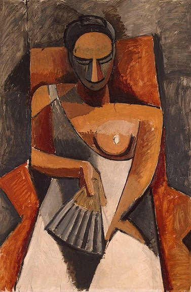

[🏠 Home](../../index.md)

# June 12

## 🧑‍🎨 Painting of the day

[Pablo Picasso](http://en.wikipedia.org/wiki/Pablo_Picasso) (Cubism)

<button class="btn btn-success"
onclick=" window.open('https://lens.google.com/uploadbyurl?url=https://iretes.github.io/one-a-day/data/img/Pablo_Picasso_1.jpg','_blank')">
Search with Google Lens
</button>

## 🎼 Song of the day

> *Desolation Row*
by Bob Dylan

 Written by Dylan.

Released in Aug, 1965.

<button class="btn btn-success"
onclick=" window.open('http://www.youtube.com/search?q=Desolation Row by Bob Dylan','_blank')">
Search on YouTube
</button>

## 🏛️ UNESCO heritage site of the day

> *Archaeological Sites of Bat, Al-Khutm and Al-Ayn*, Oman

The protohistoric site of Bat lies near a palm grove in the interior of the Sultanate of Oman. Together with the neighbouring sites, it forms the most complete collection of settlements and necropolises from the 3rd millennium B.C. in the world.

<button class="btn btn-success"
onclick=" window.open('http://www.google.com/search?q=Archaeological Sites of Bat, Al-Khutm and Al-Ayn','_blank')">
Search on Google
</button>

## 🗺️ Place of the day

<iframe
src="https://www.mapcrunch.com"
name="mapcrunch"
width="500"
height="500"
allowTransparency="true"
scrolling="no"
frameborder="0"
>
</iframe>
## 🎨 Color of the day

> *[French beige](https://en.wikipedia.org/wiki/Beige#French_beige)*

&#9632;

## 🌿 Plant of the day

> *red river maple*

<button class="btn btn-success"
onclick=" window.open('http://www.google.com/search?q=red river maple','_blank')">
Search on Google
</button>

## 🧑‍🔬 Scientific discovery of the day

> *2010: The first self-replicating, synthetic bacterial cells are constructed.*

<button class="btn btn-success"
onclick=" window.open('http://www.google.com/search?q=2010: The first self-replicating, synthetic bacterial cells are constructed.','_blank')"> 
Search on Google
</button>

## 💭 Philosophical concept of the day

> *[Good](https://en.wikipedia.org/wiki/Good)*

## 🗣️ Saying of the day

> *No laughing matter*

Not a subject for levity. 

## 🏳️‍🌈 International day

World Day Against Child Labour.