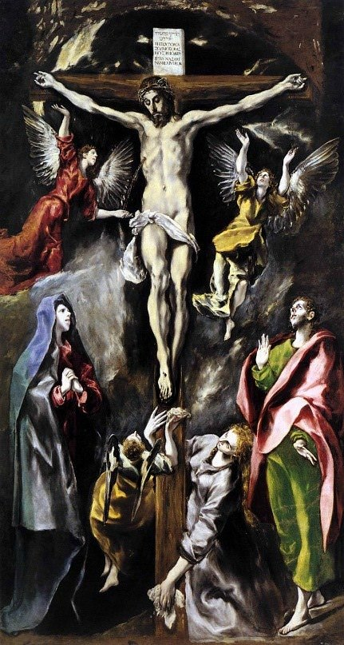

[🏠 Home](../../index.md)

# June 13

## 🧑‍🎨 Painting of the day

[El Greco](http://en.wikipedia.org/wiki/El_Greco) (Mannerism)

<button class="btn btn-success"
onclick=" window.open('https://lens.google.com/uploadbyurl?url=https://iretes.github.io/one-a-day/data/img/El_Greco_6.jpg','_blank')">
Search with Google Lens
</button>

## 🎼 Song of the day

> *Please Please Me*
by The Beatles

 Written by John Lennon, Paul McCartney.

Released in Feb, 1964.

<button class="btn btn-success"
onclick=" window.open('http://www.youtube.com/search?q=Please Please Me by The Beatles','_blank')">
Search on YouTube
</button>

## 🏛️ UNESCO heritage site of the day

> *Archaeological Site of Carthage*, Tunisia

Carthage was founded in the 9th century B.C. on the Gulf of Tunis. From the 6th century onwards, it developed into a great trading empire covering much of the Mediterranean and was home to a brilliant civilization. In the course of the long Punic wars, Carthage occupied territories belonging to Rome, which finally destroyed its rival in 146 B.C. A second – Roman – Carthage was then established on the ruins of the first.

<button class="btn btn-success"
onclick=" window.open('http://www.google.com/search?q=Archaeological Site of Carthage','_blank')">
Search on Google
</button>

## 🗺️ Place of the day

<iframe
src="https://www.mapcrunch.com"
name="mapcrunch"
width="500"
height="500"
allowTransparency="true"
scrolling="no"
frameborder="0"
>
</iframe>
## 🎨 Color of the day

> *[Lawn green](https://en.wikipedia.org/wiki/Chartreuse_(color)#Lawn_green)*

&#9632;

## 🌿 Plant of the day

> *damask violet*

<button class="btn btn-success"
onclick=" window.open('http://www.google.com/search?q=damask violet','_blank')">
Search on Google
</button>

## 🧑‍🔬 Scientific discovery of the day

> *1988: Bart van Wees and colleagues at TU Deflt and Philips Research discovered the quantized conductance in a two-dimensional electron gas.*

<button class="btn btn-success"
onclick=" window.open('http://www.google.com/search?q=1988: Bart van Wees and colleagues at TU Deflt and Philips Research discovered the quantized conductance in a two-dimensional electron gas.','_blank')">
Search on Google
</button>

## 💭 Philosophical concept of the day

> *[Interpellation](https://en.wikipedia.org/wiki/Interpellation_(philosophy))*

## 🗣️ Saying of the day

> *Khyber pass*

Arse.

## 🏳️‍🌈 International day

International Albinism Awareness Day.