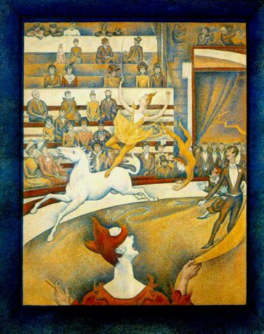

[🏠 Home](../../index.md)

# June 15

## 🧑‍🎨 Painting of the day

[Georges Seurat](https://en.wikipedia.org/wiki/Georges_Seurat) (Post-Impressionism)

<button class="btn btn-success"
onclick=" window.open('https://lens.google.com/uploadbyurl?url=https://iretes.github.io/one-a-day/data/img/Georges_Seurat_6.jpg','_blank')">
Search with Google Lens
</button>

## 🎼 Song of the day

> *Save the Last Dance for Me*
by The Drifters

 Written by Doc Pomus, Mort Shuman.

Released in Sept, 1960.

<button class="btn btn-success"
onclick=" window.open('http://www.youtube.com/search?q=Save the Last Dance for Me by The Drifters','_blank')">
Search on YouTube
</button>

## 🏛️ UNESCO heritage site of the day

> *La Grand-Place, Brussels*, Belgium

La Grand-Place in Brussels is a remarkably homogeneous body of public and private buildings, dating mainly from the late 17th century. The architecture provides a vivid illustration of the level of social and cultural life of the period in this important political and commercial centre.

<button class="btn btn-success"
onclick=" window.open('http://www.google.com/search?q=La Grand-Place, Brussels','_blank')">
Search on Google
</button>

## 🗺️ Place of the day

<iframe
src="https://www.mapcrunch.com"
name="mapcrunch"
width="500"
height="500"
allowTransparency="true"
scrolling="no"
frameborder="0"
>
</iframe>
## 🎨 Color of the day

> *[Violet](https://en.wikipedia.org/wiki/Violet_(color))*

&#9632;

## 🌿 Plant of the day

> *rose*

<button class="btn btn-success"
onclick=" window.open('http://www.google.com/search?q=rose','_blank')">
Search on Google
</button>

## 🧑‍🔬 Scientific discovery of the day

> *2100 BC: The concept of area is first recognized in Babylonian clay tablets, and 3-dimensional volume is discussed in an Egyptian papyrus. This begins the study of geometry.*

<button class="btn btn-success"
onclick=" window.open('http://www.google.com/search?q=2100 BC: The concept of area is first recognized in Babylonian clay tablets, and 3-dimensional volume is discussed in an Egyptian papyrus. This begins the study of geometry.','_blank')">
Search on Google
</button>

## 💭 Philosophical concept of the day

> *[Phenomenon](https://en.wikipedia.org/wiki/Phenomenon_(philosophy))*

## 🗣️ Saying of the day

> *Once more unto the breach, dear friends, once more*

Let us try again one more time.

## 🏳️‍🌈 International day

World Elder Abuse Awareness Day.