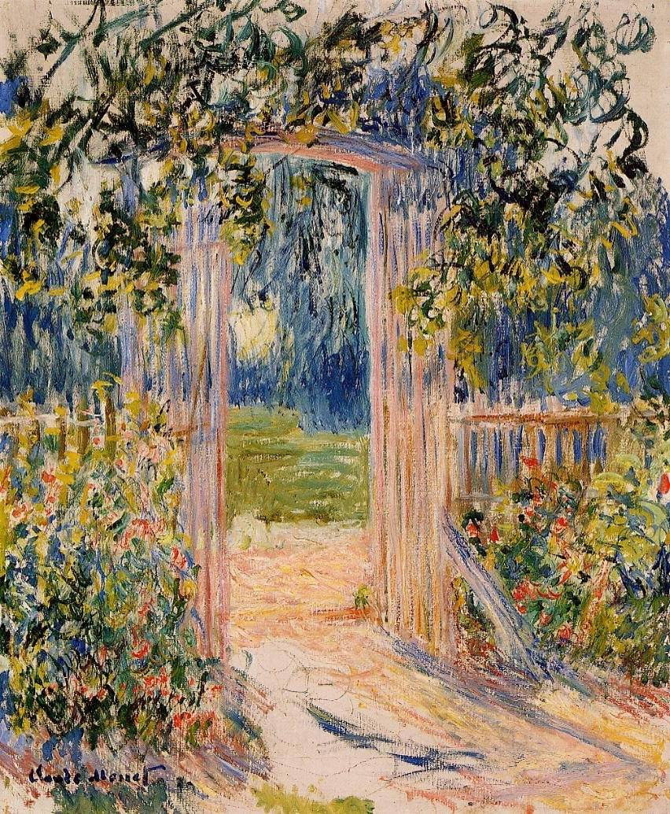

[🏠 Home](../../index.md)

# June 17

## 🧑‍🎨 Painting of the day

[Claude Monet](http://en.wikipedia.org/wiki/Claude_Monet) (Impressionism)

<button class="btn btn-success"
onclick=" window.open('https://lens.google.com/uploadbyurl?url=https://iretes.github.io/one-a-day/data/img/Claude_Monet_6.jpg','_blank')">
Search with Google Lens
</button>

## 🎼 Song of the day

> *Hey Ya!*
by OutKast

 Written by André 3000.

Released in Sept, 2003.

<button class="btn btn-success"
onclick=" window.open('http://www.youtube.com/search?q=Hey Ya! by OutKast','_blank')">
Search on YouTube
</button>

## 🏛️ UNESCO heritage site of the day

> *Saloum Delta*, Senegal

Fishing and shellfish gathering have sustained human life in the 5,000 km2 property, which is formed by the arms of three rivers. The site comprises brackish channels encompassing over 200 islands and islets, mangrove forest, an Atlantic marine environment, and dry forest.

The site is marked by 218 shellfish mounds, some of them several hundreds metres long, produced by its human inhabitants over the ages. Burial sites on 28 of the mounds take the form of tumuli where remarkable artefacts have been found. They are important for our understanding of cultures from the various periods of the delta's occupation and testify to the history of human settlement along the coast of West Africa.

<button class="btn btn-success"
onclick=" window.open('http://www.google.com/search?q=Saloum Delta','_blank')">
Search on Google
</button>

## 🗺️ Place of the day

<iframe
src="https://www.mapcrunch.com"
name="mapcrunch"
width="500"
height="500"
allowTransparency="true"
scrolling="no"
frameborder="0"
>
</iframe>
## 🎨 Color of the day

> *[Violet-blue (Crayola)](https://en.wikipedia.org/wiki/Violet-blue#Violet-blue_(Crayola))*

&#9632;

## 🌿 Plant of the day

> *pistachio*

<button class="btn btn-success"
onclick=" window.open('http://www.google.com/search?q=pistachio','_blank')">
Search on Google
</button>

## 🧑‍🔬 Scientific discovery of the day

> *Late 4th century BC: Chanakya (also known as Kautilya) establishes the field of economics with the Arthashastra (literally "Science of wealth"), a prescriptive treatise on economics and statecraft for Mauryan India.*

<button class="btn btn-success"
onclick=" window.open('http://www.google.com/search?q=Late 4th century BC: Chanakya (also known as Kautilya) establishes the field of economics with the Arthashastra (literally Science of wealth), a prescriptive treatise on economics and statecraft for Mauryan India.','_blank')"> 
Search on Google
</button>

## 💭 Philosophical concept of the day

> *[Universal](https://en.wikipedia.org/wiki/Universal_(metaphysics))*

## 🗣️ Saying of the day

> *Bet your bottom dollar*

Bet your last coin.

## 🏳️‍🌈 International day

World Day to Combat Desertification and Drought.