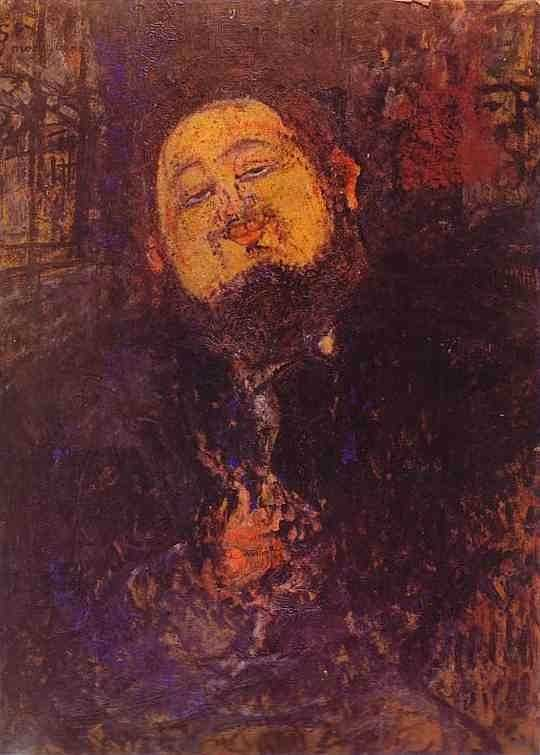

[🏠 Home](../../index.md)

# June 18

## 🧑‍🎨 Painting of the day

[Amedeo Modigliani](http://en.wikipedia.org/wiki/Amedeo_Modigliani) (Expressionism)

<button class="btn btn-success"
onclick=" window.open('https://lens.google.com/uploadbyurl?url=https://iretes.github.io/one-a-day/data/img/Amedeo_Modigliani_7.jpg','_blank')">
Search with Google Lens
</button>

## 🎼 Song of the day

> *Love Will Tear Us Apart*
by Joy Division

 Written by Ian Curtis, Peter Hook, Stephen Morris, Bernard Sumner.

Released in April, 1980.

<button class="btn btn-success"
onclick=" window.open('http://www.youtube.com/search?q=Love Will Tear Us Apart by Joy Division','_blank')">
Search on YouTube
</button>

## 🏛️ UNESCO heritage site of the day

> *Canaima National Park*, Venezuela (Bolivarian Republic of)

Canaima National Park is spread over 3 million ha in south-eastern Venezuela along the border between Guyana and Brazil. Roughly 65% of the park is covered by table mountain (tepui) formations. The tepuis constitute a unique biogeological entity and are of great geological interest. The sheer cliffs and waterfalls, including the world's highest (1,000 m), form a spectacular landscape.

<button class="btn btn-success"
onclick=" window.open('http://www.google.com/search?q=Canaima National Park','_blank')">
Search on Google
</button>

## 🗺️ Place of the day

<iframe
src="https://www.mapcrunch.com"
name="mapcrunch"
width="500"
height="500"
allowTransparency="true"
scrolling="no"
frameborder="0"
>
</iframe>
## 🎨 Color of the day

> *[Gray (web)](https://en.wikipedia.org/wiki/Shades_of_gray#Gray)*

&#9632;

## 🌿 Plant of the day

> *skunk cabbage*

<button class="btn btn-success"
onclick=" window.open('http://www.google.com/search?q=skunk cabbage','_blank')">
Search on Google
</button>

## 🧑‍🔬 Scientific discovery of the day

> *1600: William Gilbert: Earth's magnetic field.*

<button class="btn btn-success"
onclick=" window.open('http://www.google.com/search?q=1600: William Gilbert: Earth s magnetic field.','_blank')">
Search on Google
</button>

## 💭 Philosophical concept of the day

> *[Essence](https://en.wikipedia.org/wiki/Essence)*

## 🗣️ Saying of the day

> *Ball and chain*

A 20th century slang term, meaning wife.

## 🏳️‍🌈 International day

International Day for Countering Hate Speech, Sustainable Gastronomy Day.