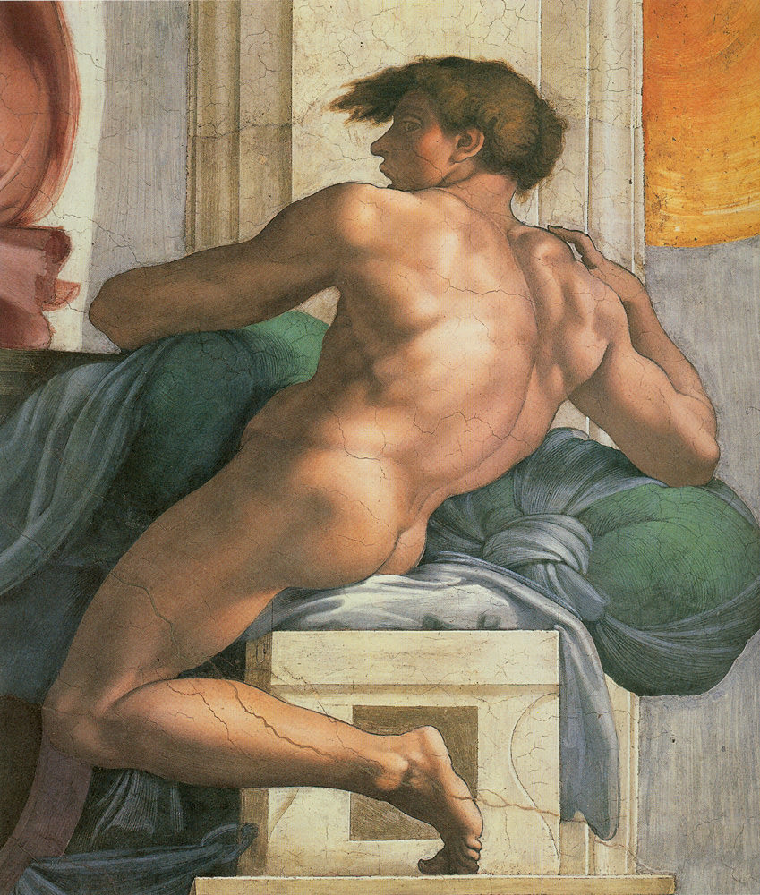

[🏠 Home](../../index.md)

# June 19

## 🧑‍🎨 Painting of the day

[Michelangelo](https://en.wikipedia.org/wiki/Michelangelo) (High Renaissance)

<button class="btn btn-success"
onclick=" window.open('https://lens.google.com/uploadbyurl?url=https://iretes.github.io/one-a-day/data/img/Michelangelo_3.jpg','_blank')">
Search with Google Lens
</button>

## 🎼 Song of the day

> *September Gurls*
by Big Star

 Written by Alex Chilton.

Released in May, 1974.

<button class="btn btn-success"
onclick=" window.open('http://www.youtube.com/search?q=September Gurls by Big Star','_blank')">
Search on YouTube
</button>

## 🏛️ UNESCO heritage site of the day

> *Archaeological Sites of the Island of Meroe*, Sudan

The Archaeological Sites of the Island of Meroe, a semi-desert landscape between the Nile and Atbara rivers, was the heartland of the Kingdom of Kush, a major power from the 8th century B.C. to the 4th century A.D. The property consists of the royal city of the Kushite kings at Meroe, near the River Nile, the nearby religious site of Naqa and Musawwarat es Sufra. It was the seat of the rulers who occupied Egypt for close to a century and features, among other vestiges, pyramids, temples and domestic buildings as well as major installations connected to water management. Their vast empire extended from the Mediterranean to the heart of Africa, and the property testifies to the exchange between the art, architectures, religions and languages of both regions.

<button class="btn btn-success"
onclick=" window.open('http://www.google.com/search?q=Archaeological Sites of the Island of Meroe','_blank')">
Search on Google
</button>

## 🗺️ Place of the day

<iframe
src="https://www.mapcrunch.com"
name="mapcrunch"
width="500"
height="500"
allowTransparency="true"
scrolling="no"
frameborder="0"
>
</iframe>
## 🎨 Color of the day

> *[Flax](https://en.wikipedia.org/wiki/Flax_(color))*

&#9632;

## 🌿 Plant of the day

> *baby rose*

<button class="btn btn-success"
onclick=" window.open('http://www.google.com/search?q=baby rose','_blank')">
Search on Google
</button>

## 🧑‍🔬 Scientific discovery of the day

> *1847: George Boole: publishes The Mathematical Analysis of Logic, defining Boolean algebra; refined in his 1854 The Laws of Thought.*

<button class="btn btn-success"
onclick=" window.open('http://www.google.com/search?q=1847: George Boole: publishes The Mathematical Analysis of Logic, defining Boolean algebra; refined in his 1854 The Laws of Thought.','_blank')">
Search on Google
</button>

## 💭 Philosophical concept of the day

> *[Social contract](https://en.wikipedia.org/wiki/Social_contract)*

## 🗣️ Saying of the day

> *Knock into a cocked hat *

To beat  severely. 

## 🏳️‍🌈 International day

International Day for the Elimination of Sexual Violence in Conflict.