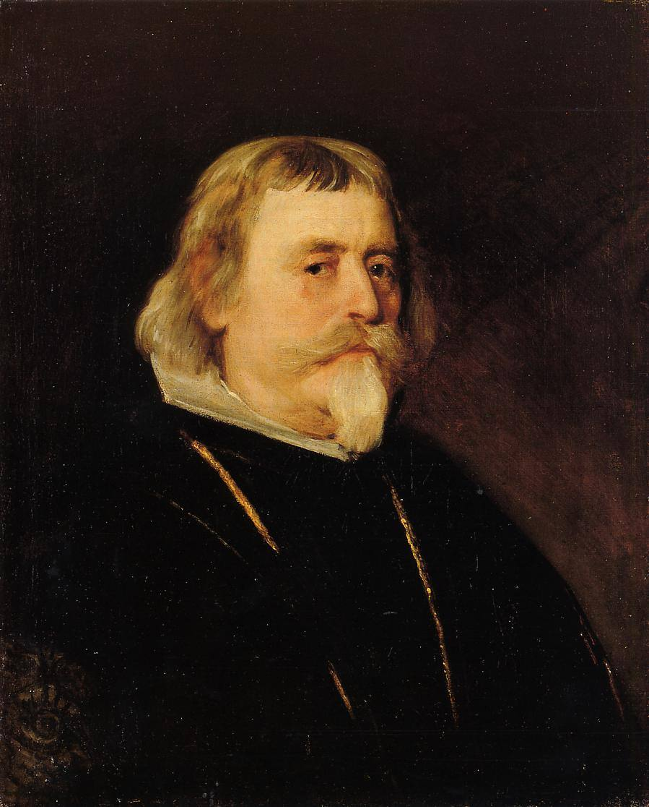

[🏠 Home](../../index.md)

# June 2

## 🧑‍🎨 Painting of the day

[Diego Velazquez](http://en.wikipedia.org/wiki/Diego_Velázquez) (Baroque)

<button class="btn btn-success"
onclick=" window.open('https://lens.google.com/uploadbyurl?url=https://iretes.github.io/one-a-day/data/img/Diego_Velazquez_3.jpg','_blank')">
Search with Google Lens
</button>

## 🎼 Song of the day

> *Peggy Sue*
by Buddy Holly

 Written by Jerry Allison, Holly, Norman Petty.

Released in Sept, 1957.

<button class="btn btn-success"
onclick=" window.open('http://www.youtube.com/search?q=Peggy Sue by Buddy Holly','_blank')">
Search on YouTube
</button>

## 🏛️ UNESCO heritage site of the day

> *Petroglyphs of Lake Onega and the White Sea*, Russian Federation

The site contains 4,500 petroglyphs carved in the rocks during the Neolithic period dated 6 to 7 thousand years ago and located in the Republic of Karelia in the Russian Federation. It is one of the largest such sites in Europe with petroglyphs that document Neolithic culture in Fennoscandia. The serial property encompasses 33 sites in two component parts 300km apart: 22 petroglyph sites at Lake Onega in the District of Pudozhsky featuring a total of over 1,200 figures and 3,411 figures in 11 sites by the White Sea in the District of Belomorsky. The rock art figures at Lake Onega mostly represents birds, animals, half human and half animal figures as well as geometric shapes that may be symbols of the moon and the sun. The petroglyphs of the White Sea are mostly composed of carvings depicting hunting and sailing scenes including their related equipment as well as animal and human footprints. They show significant artistic qualities and testify to the creativity of the Stone Age. The petroglyphs are associated with sites including settlements and burial grounds. 

<button class="btn btn-success"
onclick=" window.open('http://www.google.com/search?q=Petroglyphs of Lake Onega and the White Sea','_blank')">
Search on Google
</button>

## 🗺️ Place of the day

<iframe
src="https://www.mapcrunch.com"
name="mapcrunch"
width="500"
height="500"
allowTransparency="true"
scrolling="no"
frameborder="0"
>
</iframe>
## 🎨 Color of the day

> *[Blue-violet](https://en.wikipedia.org/wiki/Indigo#Deep_indigo_(web_color_blue-violet))*

&#9632;

## 🌿 Plant of the day

> *betula lenta*

<button class="btn btn-success"
onclick=" window.open('http://www.google.com/search?q=betula lenta','_blank')">
Search on Google
</button>

## 🧑‍🔬 Scientific discovery of the day

> *165 BC - 142 BC: Zhang Cang in Northern China is credited with the development of Gaussian elimination.*

<button class="btn btn-success"
onclick=" window.open('http://www.google.com/search?q=165 BC - 142 BC: Zhang Cang in Northern China is credited with the development of Gaussian elimination.','_blank')">
Search on Google
</button>

## 💭 Philosophical concept of the day

> *[Supertask](https://en.wikipedia.org/wiki/Supertask)*

## 🗣️ Saying of the day

> *As X as Y*

A simile is a comparison of one thing with another.
