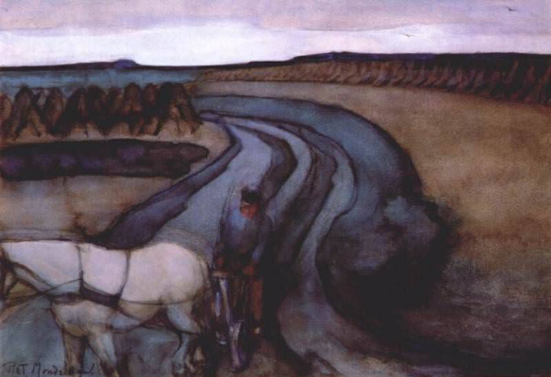

[🏠 Home](../../index.md)

# June 20

## 🧑‍🎨 Painting of the day

[Piet Mondrian](https://en.wikipedia.org/wiki/Piet_Mondrian) (Neoplasticism)

<button class="btn btn-success"
onclick=" window.open('https://lens.google.com/uploadbyurl?url=https://iretes.github.io/one-a-day/data/img/Piet_Mondrian_4.jpg','_blank')">
Search with Google Lens
</button>

## 🎼 Song of the day

> *Free Fallin*
by Tom Petty

 Written by Petty, Jeff Lynne.

Released in June, 1989.

<button class="btn btn-success"
onclick=" window.open('http://www.youtube.com/search?q=Free Fallin by Tom Petty','_blank')">
Search on YouTube
</button>

## 🏛️ UNESCO heritage site of the day

> *Fujisan, sacred place and source of artistic inspiration*, Japan

The beauty of the solitary, often snow-capped, stratovolcano, known around the world as Mount Fuji, rising above villages and tree-fringed sea and lakes has long been the object of pilgrimages and inspired artists and poets. The inscribed property consists of 25 sites which reflect the essence of Fujisan’s sacred and artistic landscape. In the 12th century, Fujisan became the centre of training for ascetic Buddhism, which included Shinto elements. On the upper 1,500-metre tier of the 3,776m mountain, pilgrim routes and crater shrines have been inscribed alongside sites around the base of the mountain including Sengen-jinja shrines, Oshi lodging houses, and natural volcanic features such as lava tree moulds, lakes, springs and waterfalls, which are revered as sacred. Its representation in Japanese art goes back to the 11th century, but 19th century woodblock prints of views, including those from sand beaches with pine tree groves have made Fujisan an internationally recognized icon of Japan and have had a deep impact on the development of Western art. 

<button class="btn btn-success"
onclick=" window.open('http://www.google.com/search?q=Fujisan, sacred place and source of artistic inspiration','_blank')">
Search on Google
</button>

## 🗺️ Place of the day

<iframe
src="https://www.mapcrunch.com"
name="mapcrunch"
width="500"
height="500"
allowTransparency="true"
scrolling="no"
frameborder="0"
>
</iframe>
## 🎨 Color of the day

> *[Azure (X11/web color)](https://en.wikipedia.org/wiki/Shades_of_azure#Azure_(web_color))*

&#9632;

## 🌿 Plant of the day

> *appalachian tea*

<button class="btn btn-success"
onclick=" window.open('http://www.google.com/search?q=appalachian tea','_blank')">
Search on Google
</button>

## 🧑‍🔬 Scientific discovery of the day

> *816: Jain mathematician Virasena describes the integer logarithm.*

<button class="btn btn-success"
onclick=" window.open('http://www.google.com/search?q=816: Jain mathematician Virasena describes the integer logarithm.','_blank')"> 
Search on Google
</button>

## 💭 Philosophical concept of the day

> *[Logical constant](https://en.wikipedia.org/wiki/Logical_constant)*

## 🗣️ Saying of the day

> *Nine days' wonder*

A novelty that loses its appeal after a few days. 

## 🏳️‍🌈 International day

World Refugee Day.