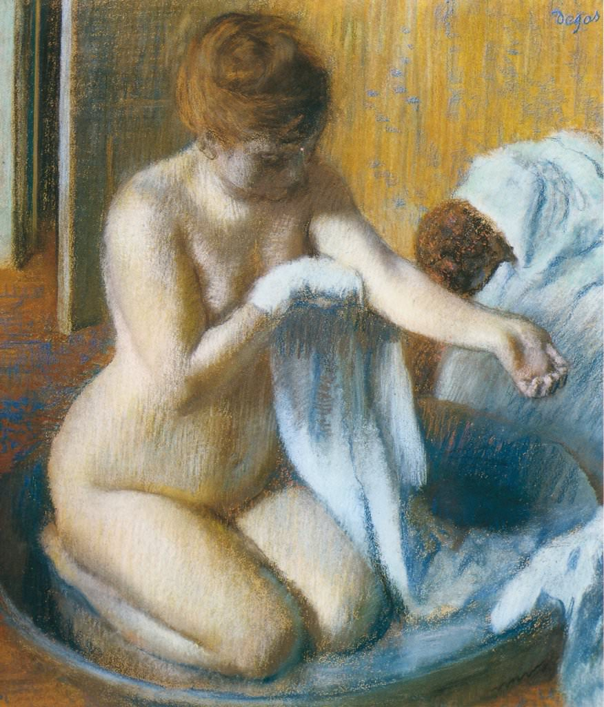

[🏠 Home](../../index.md)

# June 21

## 🧑‍🎨 Painting of the day

[Edgar Degas](http://en.wikipedia.org/wiki/Edgar_Degas) (Impressionism)

<button class="btn btn-success"
onclick=" window.open('https://lens.google.com/uploadbyurl?url=https://iretes.github.io/one-a-day/data/img/Edgar_Degas_6.jpg','_blank')">
Search with Google Lens
</button>

## 🎼 Song of the day

> *Dont Worry Baby*
by The Beach Boys

 Written by Brian Wilson, Roger Christian.

Released in May, 1964.

<button class="btn btn-success"
onclick=" window.open('http://www.youtube.com/search?q=Dont Worry Baby by The Beach Boys','_blank')">
Search on YouTube
</button>

## 🏛️ UNESCO heritage site of the day

> *Bauhaus and its Sites in Weimar, Dessau and Bernau*, Germany

Between 1919 and 1933 the Bauhaus movement revolutionized architectural and aesthetic thinking and practice in the 20th century. The Bauhaus buildings in Weimar, Dessau and Bernau are fundamental representatives of Classical Modernism, directed towards a radical renewal of architecture and design. This property, which was inscribed on the World Heritage List in 1996, originally comprised buildings located in Weimar (Former Art School, the Applied Art School and the Haus Am Horn) and Dessau (Bauhaus Building, the group of seven Masters' Houses). The 2017 extension includes the Houses with Balcony Access in Dessau and the ADGB Trade Union School in Bernau as important contributions to the Bauhaus ideas of austere design, functionalism and social reform.

<button class="btn btn-success"
onclick=" window.open('http://www.google.com/search?q=Bauhaus and its Sites in Weimar, Dessau and Bernau','_blank')">
Search on Google
</button>

## 🗺️ Place of the day

<iframe
src="https://www.mapcrunch.com"
name="mapcrunch"
width="500"
height="500"
allowTransparency="true"
scrolling="no"
frameborder="0"
>
</iframe>
## 🎨 Color of the day

> *[Zaffre](https://en.wikipedia.org/wiki/Zaffre)*

&#9632;

## 🌿 Plant of the day

> *false boxwood*

<button class="btn btn-success"
onclick=" window.open('http://www.google.com/search?q=false boxwood','_blank')">
Search on Google
</button>

## 🧑‍🔬 Scientific discovery of the day

> *499: Aryabhata develops Kuṭṭaka, an algorithm very similar to the Extended Euclidean algorithm.*

<button class="btn btn-success"
onclick=" window.open('http://www.google.com/search?q=499: Aryabhata develops Kuṭṭaka, an algorithm very similar to the Extended Euclidean algorithm.','_blank')">
Search on Google
</button>

## 💭 Philosophical concept of the day

> *[Reciprocity](https://en.wikipedia.org/wiki/Reciprocity_(social_and_political_philosophy))*

## 🗣️ Saying of the day

> *Play second fiddle*

To 'play second fiddle' is to take a subordinate position to another person.

## 🏳️‍🌈 International day

International Day of Yoga, International Day of the Celebration of the Solstice.