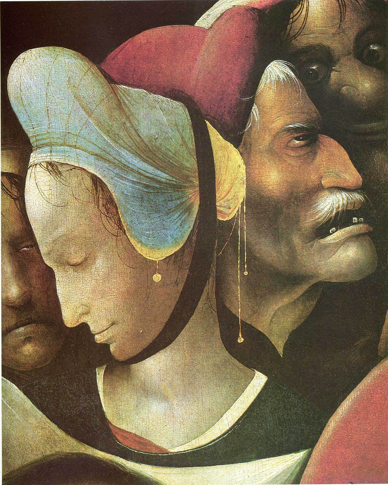

[🏠 Home](../../index.md)

# June 22

## 🧑‍🎨 Painting of the day

[Hieronymus Bosch](http://en.wikipedia.org/wiki/Hieronymus_Bosch) (Northern Renaissance)

<button class="btn btn-success"
onclick=" window.open('https://lens.google.com/uploadbyurl?url=https://iretes.github.io/one-a-day/data/img/Hieronymus_Bosch_4.jpg','_blank')">
Search with Google Lens
</button>

## 🎼 Song of the day

> *I Fought the Law*
by The Bobby Fuller Four

 Written by Sonny Curtis, Fuller.

Released in Feb, 1966.

<button class="btn btn-success"
onclick=" window.open('http://www.youtube.com/search?q=I Fought the Law by The Bobby Fuller Four','_blank')">
Search on YouTube
</button>

## 🏛️ UNESCO heritage site of the day

> *Museumsinsel (Museum Island), Berlin*, Germany

The museum as a social phenomenon owes its origins to the Age of Enlightenment in the 18th century. The five museums on the Museumsinsel in Berlin, built between 1824 and 1930, are the realization of a visionary project and show the evolution of approaches to museum design over the course of the 20th century. Each museum was designed so as to establish an organic connection with the art it houses. The importance of the museum's collections &ndash; which trace the development of civilizations throughout the ages &ndash; is enhanced by the urban and architectural quality of the buildings.

<button class="btn btn-success"
onclick=" window.open('http://www.google.com/search?q=Museumsinsel (Museum Island), Berlin','_blank')">
Search on Google
</button>

## 🗺️ Place of the day

<iframe
src="https://www.mapcrunch.com"
name="mapcrunch"
width="500"
height="500"
allowTransparency="true"
scrolling="no"
frameborder="0"
>
</iframe>
## 🎨 Color of the day

> *[Burlywood](https://en.wikipedia.org/wiki/X11_color_names#Color_name_charts)*

&#9632;

## 🌿 Plant of the day

> *fumewort*

<button class="btn btn-success"
onclick=" window.open('http://www.google.com/search?q=fumewort','_blank')">
Search on Google
</button>

## 🧑‍🔬 Scientific discovery of the day

> *460 BC: Empedocles describes thermal expansion.*

<button class="btn btn-success"
onclick=" window.open('http://www.google.com/search?q=460 BC: Empedocles describes thermal expansion.','_blank')"> 
Search on Google
</button>

## 💭 Philosophical concept of the day

> *[Art](https://en.wikipedia.org/wiki/Art)*

## 🗣️ Saying of the day

> *Economical with the truth*

Conveying an untrue version of events by leaving out the important facts. A euphemism for lying, in short. 
