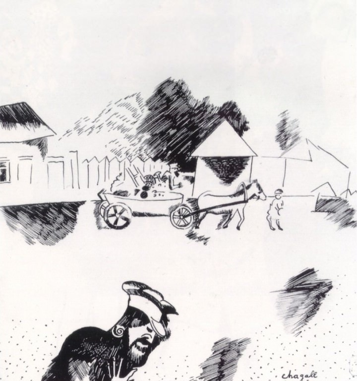

[🏠 Home](../../index.md)

# June 23

## 🧑‍🎨 Painting of the day

[Marc Chagall](http://en.wikipedia.org/wiki/Marc_Chagall) (Primitivism)

<button class="btn btn-success"
onclick=" window.open('https://lens.google.com/uploadbyurl?url=https://iretes.github.io/one-a-day/data/img/Marc_Chagall_3.jpg','_blank')">
Search with Google Lens
</button>

## 🎼 Song of the day

> *Paint it Black*
by The Rolling Stones

 Written by Mick Jagger, Keith Richards.

Released in May, 1966.

<button class="btn btn-success"
onclick=" window.open('http://www.youtube.com/search?q=Paint it Black by The Rolling Stones','_blank')">
Search on YouTube
</button>

## 🏛️ UNESCO heritage site of the day

> *Old City of Salamanca*, Spain

This ancient university town north-west of Madrid was first conquered by the Carthaginians in the 3rd century B.C. It then became a Roman settlement before being ruled by the Moors until the 11th century. The university, one of the oldest in Europe, reached its high point during Salamanca's golden age. The city's historic centre has important Romanesque, Gothic, Moorish, Renaissance and Baroque monuments. The Plaza Mayor, with its galleries and arcades, is particularly impressive.

<button class="btn btn-success"
onclick=" window.open('http://www.google.com/search?q=Old City of Salamanca','_blank')">
Search on Google
</button>

## 🗺️ Place of the day

<iframe
src="https://www.mapcrunch.com"
name="mapcrunch"
width="500"
height="500"
allowTransparency="true"
scrolling="no"
frameborder="0"
>
</iframe>
## 🎨 Color of the day

> *[Cardinal](https://en.wikipedia.org/wiki/Cardinal_(color))*

&#9632;

## 🌿 Plant of the day

> *red oak*

<button class="btn btn-success"
onclick=" window.open('http://www.google.com/search?q=red oak','_blank')">
Search on Google
</button>

## 🧑‍🔬 Scientific discovery of the day

> *1952: Jonas Salk: developed and tested first polio vaccine*

<button class="btn btn-success"
onclick=" window.open('http://www.google.com/search?q=1952: Jonas Salk: developed and tested first polio vaccine','_blank')"> 
Search on Google
</button>

## 💭 Philosophical concept of the day

> *[Atman](https://en.wikipedia.org/wiki/Atman_(disambiguation))*

## 🗣️ Saying of the day

> *Aga saga*

An 'aga saga' is a genre of popular fiction usually set in comfortable middle-class English homes.

## 🏳️‍🌈 International day

International Widows' Day, United Nations Public Service Day.