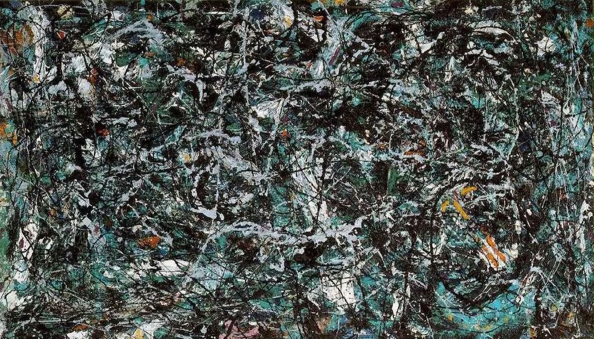

[🏠 Home](../../index.md)

# June 26

## 🧑‍🎨 Painting of the day

[Jackson Pollock](http://en.wikipedia.org/wiki/Jackson_Pollock) (Abstract Expressionism)

<button class="btn btn-success"
onclick=" window.open('https://lens.google.com/uploadbyurl?url=https://iretes.github.io/one-a-day/data/img/Jackson_Pollock_6.jpg','_blank')">
Search with Google Lens
</button>

## 🎼 Song of the day

> *Dream On*
by Aerosmith

 Written by Steven Tyler.

Released in June, 1973.

<button class="btn btn-success"
onclick=" window.open('http://www.youtube.com/search?q=Dream On by Aerosmith','_blank')">
Search on YouTube
</button>

## 🏛️ UNESCO heritage site of the day

> *Old Town of Ávila with its Extra-Muros Churches*, Spain

Founded in the 11th century to protect the Spanish territories from the Moors, this 'City of Saints and Stones', the birthplace of St Teresa and the burial place of the Grand Inquisitor Torquemada, has kept its medieval austerity. This purity of form can still be seen in the Gothic cathedral and the fortifications which, with their 82 semicircular towers and nine gates, are the most complete in Spain.

<button class="btn btn-success"
onclick=" window.open('http://www.google.com/search?q=Old Town of Ávila with its Extra-Muros Churches','_blank')">
Search on Google
</button>

## 🗺️ Place of the day

<iframe
src="https://www.mapcrunch.com"
name="mapcrunch"
width="500"
height="500"
allowTransparency="true"
scrolling="no"
frameborder="0"
>
</iframe>
## 🎨 Color of the day

> *[Violet-red](https://en.wikipedia.org/wiki/Red-violet#Violet-red)*

&#9632;

## 🌿 Plant of the day

> *blackberry*

<button class="btn btn-success"
onclick=" window.open('http://www.google.com/search?q=blackberry','_blank')">
Search on Google
</button>

## 🧑‍🔬 Scientific discovery of the day

> *1861: John Tyndall: Experiments in Radiant Energy that reinforced the Greenhouse effect.*

<button class="btn btn-success"
onclick=" window.open('http://www.google.com/search?q=1861: John Tyndall: Experiments in Radiant Energy that reinforced the Greenhouse effect.','_blank')"> 
Search on Google
</button>

## 💭 Philosophical concept of the day

> *[Happiness](https://en.wikipedia.org/wiki/Happiness)*

## 🗣️ Saying of the day

> *Hat trick*

A series of three consecutive successes, in sport or some other area of activity.

## 🏳️‍🌈 International day

International Day against Drug Abuse and Illicit Trafficking, United Nations International Day in Support of Victims of Torture.