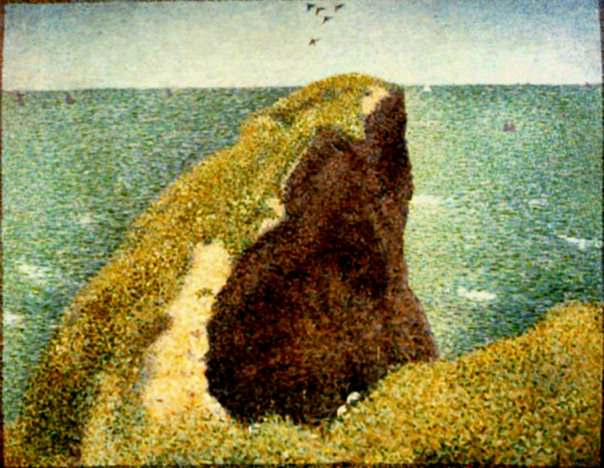

[🏠 Home](../../index.md)

# June 27

## 🧑‍🎨 Painting of the day

[Georges Seurat](https://en.wikipedia.org/wiki/Georges_Seurat) (Post-Impressionism)

<button class="btn btn-success"
onclick=" window.open('https://lens.google.com/uploadbyurl?url=https://iretes.github.io/one-a-day/data/img/Georges_Seurat_5.jpg','_blank')">
Search with Google Lens
</button>

## 🎼 Song of the day

> *99 Problems*
by Jay-Z

 Written by Jay-Z, Rick Rubin.

Released in Nov, 2003.

<button class="btn btn-success"
onclick=" window.open('http://www.youtube.com/search?q=99 Problems by Jay-Z','_blank')">
Search on YouTube
</button>

## 🏛️ UNESCO heritage site of the day

> *The work of engineer Eladio Dieste: Church of Atlántida*, Uruguay

The Church of Atlántida with its belfry and underground baptistery is located in Estación Atlántida, 45 km away from Montevideo. Inspired by Italian paleo-Christian and medieval religious architecture, the modernistic Church complex, inaugurated in 1960, represents a novel utilization of exposed and reinforced brick. Built on rectangular plan of one single hall, the church features distinctive undulating walls supporting a similarly undulating roof, composed of a sequence of reinforced brick Gaussian vaults developed by Eladio Dieste (1917-2000). The cylindrical bell-tower, built in openwork exposed brick masonry, rises from the ground to the right of the main church facade, while the underground baptistery is located on the left side of the parvis, accessible from a triangular prismatic entrance and illuminated via a central oculus. The Church provides an eminent example of the remarkable formal and spatial achievements of modern architecture in Latin America during the second part of the 20th century, embodying the search for social equality with a spare use of resources, meeting structural imperatives to great aesthetic effect.

<button class="btn btn-success"
onclick=" window.open('http://www.google.com/search?q=The work of engineer Eladio Dieste: Church of Atlántida','_blank')">
Search on Google
</button>

## 🗺️ Place of the day

<iframe
src="https://www.mapcrunch.com"
name="mapcrunch"
width="500"
height="500"
allowTransparency="true"
scrolling="no"
frameborder="0"
>
</iframe>
## 🎨 Color of the day

> *[Vanilla ice](https://en.wikipedia.org/wiki/Vanilla_(color)#Vanilla_ice)*

&#9632;

## 🌿 Plant of the day

> *deadnettle*

<button class="btn btn-success"
onclick=" window.open('http://www.google.com/search?q=deadnettle','_blank')">
Search on Google
</button>

## 🧑‍🔬 Scientific discovery of the day

> *628: Brahmagupta provides an explicit solution to the quadratic equation.*

<button class="btn btn-success"
onclick=" window.open('http://www.google.com/search?q=628: Brahmagupta provides an explicit solution to the quadratic equation.','_blank')">
Search on Google
</button>

## 💭 Philosophical concept of the day

> *[Slippery slope](https://en.wikipedia.org/wiki/Slippery_slope)*

## 🗣️ Saying of the day

> *Tower of strength*

Someone who can be relied on to provide support and comfort.

## 🏳️‍🌈 International day

Micro-, Small and Medium-sized Enterprises Day.