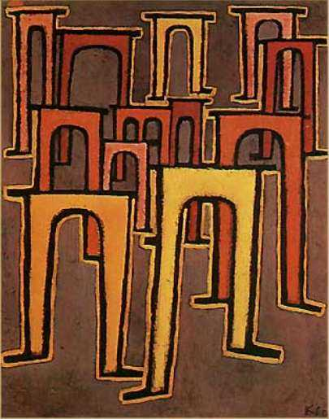

[🏠 Home](../../index.md)

# June 28

## 🧑‍🎨 Painting of the day

[Paul Klee](https://en.wikipedia.org/wiki/Paul_Klee) (Expressionism, Abstractionism, Surrealism)

<button class="btn btn-success"
onclick=" window.open('https://lens.google.com/uploadbyurl?url=https://iretes.github.io/one-a-day/data/img/Paul_Klee_1.jpg','_blank')">
Search with Google Lens
</button>

## 🎼 Song of the day

> *Both Sides Now*
by Joni Mitchell

 Written by Mitchell.

Released in May, 1969.

<button class="btn btn-success"
onclick=" window.open('http://www.youtube.com/search?q=Both Sides Now by Joni Mitchell','_blank')">
Search on YouTube
</button>

## 🏛️ UNESCO heritage site of the day

> *Cultural Landscape of Bali Province: the <em>Subak</em> System as a Manifestation of the <em>Tri Hita Karana</em> Philosophy*, Indonesia

The cultural landscape of Bali consists of five rice terraces and their water temples that cover 19,500&nbsp;ha. The temples are the focus of a cooperative water management system of canals and weirs, known as <em>subak,</em> that dates back to the 9th century. Included in the landscape is the 18th-century Royal Water Temple of Pura Taman Ayun, the largest and most impressive architectural edifice of its type on the island. The <em>subak</em> reflects the philosophical concept of <em>Tri Hita Karana</em>, which brings together the realms of the spirit, the human world and nature. This philosophy was born of the cultural exchange between Bali and India over the past 2,000 years and has shaped the landscape of Bali. The <em>subak </em>system of democratic and egalitarian farming practices has enabled the Balinese to become the most prolific rice growers in the archipelago despite the challenge of supporting a dense population.

<button class="btn btn-success"
onclick=" window.open('http://www.google.com/search?q=Cultural Landscape of Bali Province: the <em>Subak</em> System as a Manifestation of the <em>Tri Hita Karana</em> Philosophy','_blank')">
Search on Google
</button>

## 🗺️ Place of the day

<iframe
src="https://www.mapcrunch.com"
name="mapcrunch"
width="500"
height="500"
allowTransparency="true"
scrolling="no"
frameborder="0"
>
</iframe>
## 🎨 Color of the day

> *[Cambridge blue](https://en.wikipedia.org/wiki/Cambridge_Blue_(colour))*

&#9632;

## 🌿 Plant of the day

> *rye*

<button class="btn btn-success"
onclick=" window.open('http://www.google.com/search?q=rye','_blank')">
Search on Google
</button>

## 🧑‍🔬 Scientific discovery of the day

> *628: Brahmagupta discovers second-order interpolation, in the form of Brahmagupta's interpolation formula.*

<button class="btn btn-success"
onclick=" window.open('http://www.google.com/search?q=628: Brahmagupta discovers second-order interpolation, in the form of Brahmagupta s interpolation formula.','_blank')">
Search on Google
</button>

## 💭 Philosophical concept of the day

> *[Artha](https://en.wikipedia.org/wiki/Artha)*

## 🗣️ Saying of the day

> *Faff about*

Dither ineffectually.
