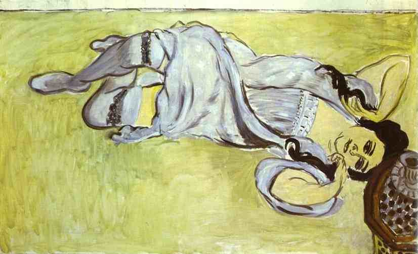

[🏠 Home](../../index.md)

# June 29

## 🧑‍🎨 Painting of the day

[Henri Matisse](http://en.wikipedia.org/wiki/Henri_Matisse) (Impressionism, Post-Impressionism)

<button class="btn btn-success"
onclick=" window.open('https://lens.google.com/uploadbyurl?url=https://iretes.github.io/one-a-day/data/img/Henri_Matisse_8.jpg','_blank')">
Search with Google Lens
</button>

## 🎼 Song of the day

> *Losing My Religion*
by R.E.M.

 Written by Berry, Buck, Mills, Stipe.

Released in March, 1991.

<button class="btn btn-success"
onclick=" window.open('http://www.youtube.com/search?q=Losing My Religion by R.E.M.','_blank')">
Search on YouTube
</button>

## 🏛️ UNESCO heritage site of the day

> *Historic Centre of Riga*, Latvia

Riga was a major centre of the Hanseatic League, deriving its prosperity in the 13th–15th centuries from the trade with central and eastern Europe. The urban fabric of its medieval centre reflects this prosperity, though most of the earliest buildings were destroyed by fire or war. Riga became an important economic centre in the 19th century, when the suburbs surrounding the medieval town were laid out, first with imposing wooden buildings in neoclassical style and then in <em>Jugendstil</em> . It is generally recognized that Riga has the finest collection of art nouveau buildings in Europe.

<button class="btn btn-success"
onclick=" window.open('http://www.google.com/search?q=Historic Centre of Riga','_blank')">
Search on Google
</button>

## 🗺️ Place of the day

<iframe
src="https://www.mapcrunch.com"
name="mapcrunch"
width="500"
height="500"
allowTransparency="true"
scrolling="no"
frameborder="0"
>
</iframe>
## 🎨 Color of the day

> *[Sapphire blue](https://en.wikipedia.org/wiki/Sapphire_(color)#Sapphire_blue)*

&#9632;

## 🌿 Plant of the day

> *purple raspberry*

<button class="btn btn-success"
onclick=" window.open('http://www.google.com/search?q=purple raspberry','_blank')">
Search on Google
</button>

## 🧑‍🔬 Scientific discovery of the day

> *1000: Al-Karaji uses mathematical induction.*

<button class="btn btn-success"
onclick=" window.open('http://www.google.com/search?q=1000: Al-Karaji uses mathematical induction.','_blank')"> 
Search on Google
</button>

## 💭 Philosophical concept of the day

> *[Norm of reciprocity](https://en.wikipedia.org/wiki/Norm_of_reciprocity)*

## 🗣️ Saying of the day

> *Carey Street - On*

Euphemism
for being bankrupt or in debt.

## 🏳️‍🌈 International day

International Day of the Tropics.