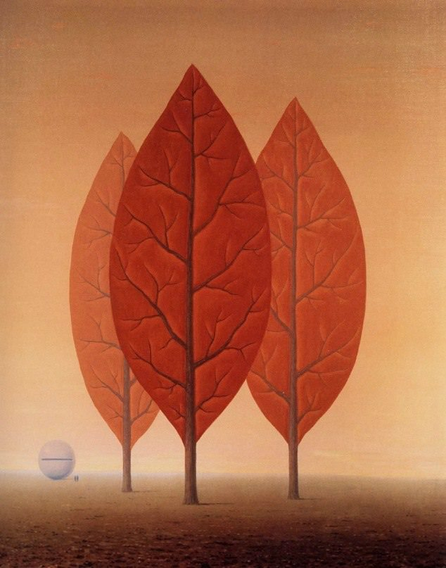

[🏠 Home](../../index.md)

# June 30

## 🧑‍🎨 Painting of the day

[Rene Magritte](http://en.wikipedia.org/wiki/René_Magritte) (Surrealism, Impressionism)

<button class="btn btn-success"
onclick=" window.open('https://lens.google.com/uploadbyurl?url=https://iretes.github.io/one-a-day/data/img/Rene_Magritte_1.jpg','_blank')">
Search with Google Lens
</button>

## 🎼 Song of the day

> *Papa Was a Rollin Stone*
by The Temptations

 Written by Norman Whitfield, Barrett Strong.

Released in Oct, 1972.

<button class="btn btn-success"
onclick=" window.open('http://www.youtube.com/search?q=Papa Was a Rollin Stone by The Temptations','_blank')">
Search on YouTube
</button>

## 🏛️ UNESCO heritage site of the day

> *Sítio Roberto Burle Marx*, Brazil

Situated west of Rio de Janeiro, the site embodies a successful project developed over more than 40 years by landscape architect and artist Roberto Burle Marx (1909-1994) to create a “living work of art” and a “landscape laboratory” using native plants and drawing on Modernist ideas. Began in 1949, the garden features the key characteristics that came to define Burle Marx’s landscape gardens and influenced the development of modern gardens internationally. The garden is characterized by sinuous forms, exuberant mass planting, architectural plant arrangements, dramatic colour contrasts, use of tropical plants, and the incorporation of elements of traditional folk culture. By the end of the 1960s, the site housed the most representative collection of Brazilian plants, alongside other rare tropical species. In the site, 3,500 cultivated species of tropical and subtropical flora grow in harmony with the native vegetation of the region, notably mangrove swamp, restinga (a distinct type of coastal tropical and subtropical moist broadleaf forest) and the Atlantic Forest. Sítio Roberto Burle Marx exhibits an ecological conception of form as a process, including social collaboration which is the basis for environmental and cultural preservation. It is the first modern tropical garden to be inscribed on the World Heritage List.

<button class="btn btn-success"
onclick=" window.open('http://www.google.com/search?q=Sítio Roberto Burle Marx','_blank')">
Search on Google
</button>

## 🗺️ Place of the day

<iframe
src="https://www.mapcrunch.com"
name="mapcrunch"
width="500"
height="500"
allowTransparency="true"
scrolling="no"
frameborder="0"
>
</iframe>
## 🎨 Color of the day

> *[United Nations blue](https://en.wikipedia.org/wiki/Shades_of_azure#United_Nations_blue)*

&#9632;

## 🌿 Plant of the day

> *shad blow*

<button class="btn btn-success"
onclick=" window.open('http://www.google.com/search?q=shad blow','_blank')">
Search on Google
</button>

## 🧑‍🔬 Scientific discovery of the day

> *60 AD: Heron's formula is discovered by Hero of Alexandria.*

<button class="btn btn-success"
onclick=" window.open('http://www.google.com/search?q=60 AD: Heron s formula is discovered by Hero of Alexandria.','_blank')">
Search on Google
</button>

## 💭 Philosophical concept of the day

> *[Transcendent](https://en.wikipedia.org/wiki/Transcendence_(philosophy))*

## 🗣️ Saying of the day

> *Let them eat cake*

The origins of many English phrases are unknown. Nevertheless, many people would say that they know the source of this one. It is widely attributed to Marie-Antoinette (1755-93), the Queen consort of Louis XVI. She is supposed to have said this when she was told that the French populace had no bread to eat. 

## 🏳️‍🌈 International day

International Asteroid Day, International Day of Parliamentarism.