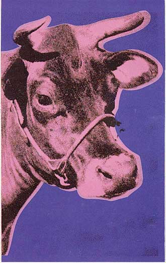

[🏠 Home](../../index.md)

# June 4

## 🧑‍🎨 Painting of the day

[Andy Warhol](https://en.wikipedia.org/wiki/Andy_Warhol) (Pop Art)

<button class="btn btn-success"
onclick=" window.open('https://lens.google.com/uploadbyurl?url=https://iretes.github.io/one-a-day/data/img/Andy_Warhol_5.jpg','_blank')">
Search with Google Lens
</button>

## 🎼 Song of the day

> *Wichita Lineman*
by Glen Campbell

 Written by Jimmy Webb.

Released in Nov, 1968.

<button class="btn btn-success"
onclick=" window.open('http://www.youtube.com/search?q=Wichita Lineman by Glen Campbell','_blank')">
Search on YouTube
</button>

## 🏛️ UNESCO heritage site of the day

> *Palmeral of Elche*, Spain

The Palmeral of Elche, a landscape of groves of date palms, was formally laid out, with elaborate irrigation systems, at the time the Muslim city of Elche was erected, towards the end of the tenth century A.C., when much of the Iberian peninsula was Arab. The Palmeral is an oasis, a system for agrarian production in arid areas. It is also a unique example of Arab agricultural practices on the European continent. Cultivation of date palms in Elche is known at least since the Iberian times, dating around the fifth century B.C.

<button class="btn btn-success"
onclick=" window.open('http://www.google.com/search?q=Palmeral of Elche','_blank')">
Search on Google
</button>

## 🗺️ Place of the day

<iframe
src="https://www.mapcrunch.com"
name="mapcrunch"
width="500"
height="500"
allowTransparency="true"
scrolling="no"
frameborder="0"
>
</iframe>
## 🎨 Color of the day

> *[Myrtle green](https://en.wikipedia.org/wiki/Shades_of_green#Mint_green)*

&#9632;

## 🌿 Plant of the day

> *wayside plantain*

<button class="btn btn-success"
onclick=" window.open('http://www.google.com/search?q=wayside plantain','_blank')">
Search on Google
</button>

## 🧑‍🔬 Scientific discovery of the day

> *1800: Alessandro Volta: discovers electrochemical series and invents the battery.*

<button class="btn btn-success"
onclick=" window.open('http://www.google.com/search?q=1800: Alessandro Volta: discovers electrochemical series and invents the battery.','_blank')">
Search on Google
</button>

## 💭 Philosophical concept of the day

> *[Disciplinary institution](https://en.wikipedia.org/wiki/Disciplinary_institution)*

## 🗣️ Saying of the day

> *Generation X*

The generation of people born between the 1950s and early 1970s, who were anarchic and directionless. 

## 🏳️‍🌈 International day

International Day of Innocent Children Victims of Aggression.