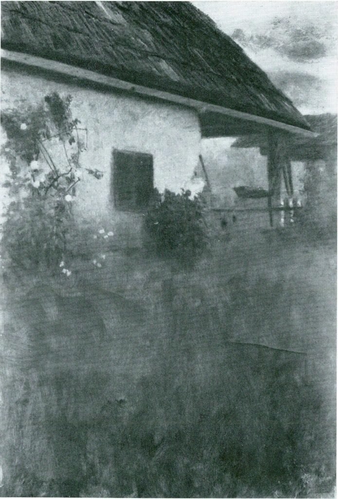

[🏠 Home](../../index.md)

# June 5

## 🧑‍🎨 Painting of the day

[Gustav Klimt](http://en.wikipedia.org/wiki/Gustav_Klimt) (Symbolism, Art Nouveau)

<button class="btn btn-success"
onclick=" window.open('https://lens.google.com/uploadbyurl?url=https://iretes.github.io/one-a-day/data/img/Gustav_Klimt_1.jpg','_blank')">
Search with Google Lens
</button>

## 🎼 Song of the day

> *Rehab*
by Amy Winehouse

 Written by Winehouse.

Released in March, 1907.

<button class="btn btn-success"
onclick=" window.open('http://www.youtube.com/search?q=Rehab by Amy Winehouse','_blank')">
Search on YouTube
</button>

## 🏛️ UNESCO heritage site of the day

> *Central University City Campus of the <i>Universidad Nacional Autónoma de México</i> (UNAM)*, Mexico

The ensemble of buildings, sports facilities and open spaces of the Central University City Campus of the Universidad Nacional Autónoma de México (UNAM), was built from 1949 to 1952 by more than 60 architects, engineers and artists who were involved in the project. As a result, the campus constitutes a unique example of 20th-century modernism integrating urbanism, architecture, engineering, landscape design and fine arts with references to local traditions, especially to Mexico’s pre-Hispanic past. The ensemble embodies social and cultural values of universal significance and is one of the most significant icons of modernity in Latin America.

<button class="btn btn-success"
onclick=" window.open('http://www.google.com/search?q=Central University City Campus of the <i>Universidad Nacional Autónoma de México</i> (UNAM)','_blank')">
Search on Google
</button>

## 🗺️ Place of the day

<iframe
src="https://www.mapcrunch.com"
name="mapcrunch"
width="500"
height="500"
allowTransparency="true"
scrolling="no"
frameborder="0"
>
</iframe>
## 🎨 Color of the day

> *[Hot pink](https://en.wikipedia.org/wiki/Shades_of_pink#Hot_pink)*

&#9632;

## 🌿 Plant of the day

> *chigger flower*

<button class="btn btn-success"
onclick=" window.open('http://www.google.com/search?q=chigger flower','_blank')">
Search on Google
</button>

## 🧑‍🔬 Scientific discovery of the day

> *2021: NASA's James Webb Space Telescope is successfully launched into orbit.*

<button class="btn btn-success"
onclick=" window.open('http://www.google.com/search?q=2021: NASA s James Webb Space Telescope is successfully launched into orbit.','_blank')"> 
Search on Google
</button>

## 💭 Philosophical concept of the day

> *[Shakti](https://en.wikipedia.org/wiki/Shakti)*

## 🗣️ Saying of the day

> *Such is life*

An acceptance of the unpredictable fortunes of existence, often spoken with an air of weary resignation. 

## 🏳️‍🌈 International day

World Environment Day, International Day for the Fight against Illegal, Unreported and Unregulated Fishing.