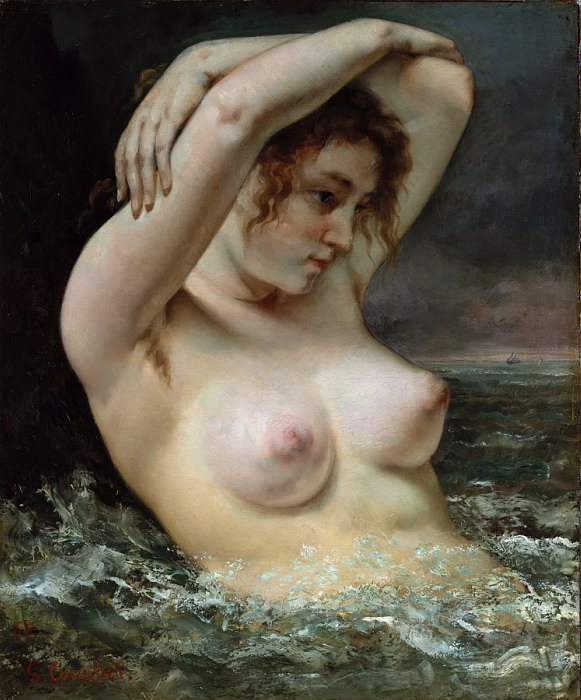

[🏠 Home](../../index.md)

# June 6

## 🧑‍🎨 Painting of the day

[Gustave Courbet](https://en.wikipedia.org/wiki/Gustave_Courbet) (Realism)

<button class="btn btn-success"
onclick=" window.open('https://lens.google.com/uploadbyurl?url=https://iretes.github.io/one-a-day/data/img/Gustave_Courbet_6.jpg','_blank')">
Search with Google Lens
</button>

## 🎼 Song of the day

> *Free Bird*
by Lynyrd Skynyrd

 Written by Allen Collins, Ronnie Van Zant.

Released in Sept, 1973.

<button class="btn btn-success"
onclick=" window.open('http://www.youtube.com/search?q=Free Bird by Lynyrd Skynyrd','_blank')">
Search on YouTube
</button>

## 🏛️ UNESCO heritage site of the day

> *Independence Hall*, United States of America

The Declaration of Independence (1776) and the Constitution of the United States (1787) were both signed in this building in Philadelphia. The universal principles of freedom and democracy set forth in these documents are of fundamental importance to American history and have also had a profound impact on law-makers around the world.

<button class="btn btn-success"
onclick=" window.open('http://www.google.com/search?q=Independence Hall','_blank')">
Search on Google
</button>

## 🗺️ Place of the day

<iframe
src="https://www.mapcrunch.com"
name="mapcrunch"
width="500"
height="500"
allowTransparency="true"
scrolling="no"
frameborder="0"
>
</iframe>
## 🎨 Color of the day

> *[Chartreuse (web)](https://en.wikipedia.org/wiki/Chartreuse_(color))*

&#9632;

## 🌿 Plant of the day

> *colwort*

<button class="btn btn-success"
onclick=" window.open('http://www.google.com/search?q=colwort','_blank')">
Search on Google
</button>

## 🧑‍🔬 Scientific discovery of the day

> *1572: Rafael Bombelli provides rules for complex arithmetic.*

<button class="btn btn-success"
onclick=" window.open('http://www.google.com/search?q=1572: Rafael Bombelli provides rules for complex arithmetic.','_blank')"> 
Search on Google
</button>

## 💭 Philosophical concept of the day

> *[Trika](https://en.wikipedia.org/wiki/Trika)*

## 🗣️ Saying of the day

> *Come up trumps*

To complete something well or successfully, especially in circumstances in which it isn't expected.

## 🏳️‍🌈 International day

Russian Language Day.