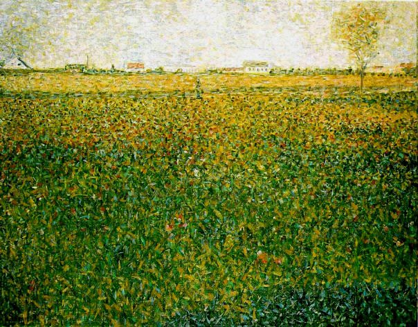

[🏠 Home](../../index.md)

# June 7

## 🧑‍🎨 Painting of the day

[Georges Seurat](https://en.wikipedia.org/wiki/Georges_Seurat) (Post-Impressionism)

<button class="btn btn-success"
onclick=" window.open('https://lens.google.com/uploadbyurl?url=https://iretes.github.io/one-a-day/data/img/Georges_Seurat_3.jpg','_blank')">
Search with Google Lens
</button>

## 🎼 Song of the day

> *Knockin on Heavens Door*
by Bob Dylan

 Written by Dylan.

Released in July, 1973.

<button class="btn btn-success"
onclick=" window.open('http://www.youtube.com/search?q=Knockin on Heavens Door by Bob Dylan','_blank')">
Search on YouTube
</button>

## 🏛️ UNESCO heritage site of the day

> *Tabriz Historic Bazaar Complex*, Iran (Islamic Republic of)

Tabriz has been a place of cultural exchange since antiquity and its historic bazaar complex is one of the most important commercial centres on the Silk Road. Tabriz Historic Bazaar Complex consists of a series of interconnected, covered, brick structures, buildings, and enclosed spaces for different functions. Tabriz and its Bazaar were already prosperous and famous in the 13th century, when the town, in the province of Eastern Azerbaijan, became the capital city of the Safavid kingdom. The city lost its status as capital in the 16th century, but remained important as a commercial hub until the end of the 18th century, with the expansion of Ottoman power. It is one of the most complete examples of the traditional commercial and cultural system of Iran.

<button class="btn btn-success"
onclick=" window.open('http://www.google.com/search?q=Tabriz Historic Bazaar Complex','_blank')">
Search on Google
</button>

## 🗺️ Place of the day

<iframe
src="https://www.mapcrunch.com"
name="mapcrunch"
width="500"
height="500"
allowTransparency="true"
scrolling="no"
frameborder="0"
>
</iframe>
## 🎨 Color of the day

> *[Silver (Crayola)](https://en.wikipedia.org/wiki/Silver_(color)#Silver_(Crayola))*

&#9632;

## 🌿 Plant of the day

> *swamp dogwood*

<button class="btn btn-success"
onclick=" window.open('http://www.google.com/search?q=swamp dogwood','_blank')">
Search on Google
</button>

## 🧑‍🔬 Scientific discovery of the day

> *6th century: Varahamira in the Gupta empire is the first to describe comets as astronomical phenomena, and as periodic in nature.*

<button class="btn btn-success"
onclick=" window.open('http://www.google.com/search?q=6th century: Varahamira in the Gupta empire is the first to describe comets as astronomical phenomena, and as periodic in nature.','_blank')"> 
Search on Google
</button>

## 💭 Philosophical concept of the day

> *[Logical consequence](https://en.wikipedia.org/wiki/Logical_consequence)*

## 🗣️ Saying of the day

> *Minced words*

To mince words is to moderate one's language, to keep within the bounds of  what is prudent or polite. Minced words are usually referred to in the negative 'do not mince your words'.

## 🏳️‍🌈 International day

World Food Safety Day.