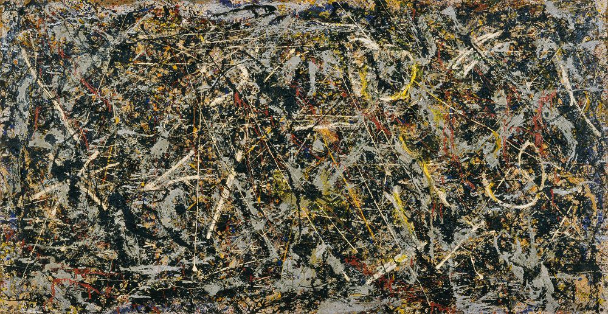

[🏠 Home](../../index.md)

# June 8

## 🧑‍🎨 Painting of the day

[Jackson Pollock](http://en.wikipedia.org/wiki/Jackson_Pollock) (Abstract Expressionism)

<button class="btn btn-success"
onclick=" window.open('https://lens.google.com/uploadbyurl?url=https://iretes.github.io/one-a-day/data/img/Jackson_Pollock_1.jpg','_blank')">
Search with Google Lens
</button>

## 🎼 Song of the day

> *Stayin Alive*
by Bee Gees

 Written by Robin Gibb, Barry Gibb, Maurice Gibb.

Released in Nov, 1977.

<button class="btn btn-success"
onclick=" window.open('http://www.youtube.com/search?q=Stayin Alive by Bee Gees','_blank')">
Search on YouTube
</button>

## 🏛️ UNESCO heritage site of the day

> *Old Bridge Area of the Old City of Mostar*, Bosnia and Herzegovina

The historic town of Mostar, spanning a deep valley of the Neretva River, developed in the 15th and 16th centuries as an Ottoman frontier town and during the Austro-Hungarian period in the 19th and 20th centuries. Mostar has long been known for its old Turkish houses and Old Bridge, Stari Most, after which it is named. In the 1990s conflict, however, most of the historic town and the Old Bridge, designed by the renowned architect Sinan, was destroyed. The Old Bridge was recently rebuilt and many of the edifices in the Old Town have been restored or rebuilt with the contribution of an international scientific committee established by UNESCO. The Old Bridge area, with its pre-Ottoman, eastern Ottoman, Mediterranean and western European architectural features, is an outstanding example of a multicultural urban settlement. The reconstructed Old Bridge and Old City of Mostar is a symbol of reconciliation, international co-operation and of the coexistence of diverse cultural, ethnic and religious communities.

<button class="btn btn-success"
onclick=" window.open('http://www.google.com/search?q=Old Bridge Area of the Old City of Mostar','_blank')">
Search on Google
</button>

## 🗺️ Place of the day

<iframe
src="https://www.mapcrunch.com"
name="mapcrunch"
width="500"
height="500"
allowTransparency="true"
scrolling="no"
frameborder="0"
>
</iframe>
## 🎨 Color of the day

> *[Cameo pink](https://en.wikipedia.org/wiki/Shades_of_pink#Cameo_pink)*

&#9632;

## 🌿 Plant of the day

> *black raspberry*

<button class="btn btn-success"
onclick=" window.open('http://www.google.com/search?q=black raspberry','_blank')">
Search on Google
</button>

## 🧑‍🔬 Scientific discovery of the day

> *1380: Madhava of Sangamagrama develops the Taylor series, and derives the Taylor series representation for the sine, cosine and arctangent functions, and uses it to produce the Leibniz series for π.*

<button class="btn btn-success"
onclick=" window.open('http://www.google.com/search?q=1380: Madhava of Sangamagrama develops the Taylor series, and derives the Taylor series representation for the sine, cosine and arctangent functions, and uses it to produce the Leibniz series for π.','_blank')"> 
Search on Google
</button>

## 💭 Philosophical concept of the day

> *[Cooperative principle (Gricean maxims)](https://en.wikipedia.org/wiki/Cooperative_principle)*

## 🗣️ Saying of the day

> *Make my day*

Carry on with what you are doing - it will give me an excuse to behave badly.

## 🏳️‍🌈 International day

World Oceans Day.