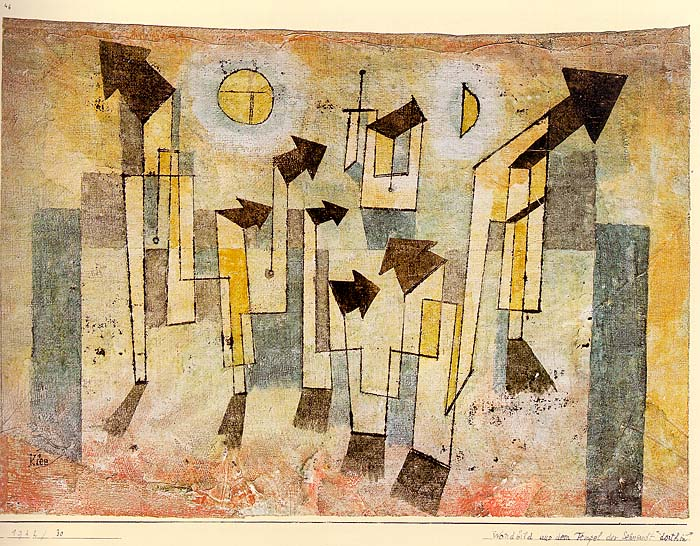

[🏠 Home](../../index.md)

# June 9

## 🧑‍🎨 Painting of the day

[Paul Klee](https://en.wikipedia.org/wiki/Paul_Klee) (Expressionism, Abstractionism, Surrealism)

<button class="btn btn-success"
onclick=" window.open('https://lens.google.com/uploadbyurl?url=https://iretes.github.io/one-a-day/data/img/Paul_Klee_3.jpg','_blank')">
Search with Google Lens
</button>

## 🎼 Song of the day

> *Back in Black*
by AC/DC

 Written by Angus Young, Malcolm Young, Brian Johnson.

Released in July, 1980.

<button class="btn btn-success"
onclick=" window.open('http://www.youtube.com/search?q=Back in Black by AC/DC','_blank')">
Search on YouTube
</button>

## 🏛️ UNESCO heritage site of the day

> *Speyer Cathedral*, Germany

Speyer Cathedral, a basilica with four towers and two domes, was founded by Conrad II in 1030 and remodelled at the end of the 11th century. It is one of the most important Romanesque monuments from the time of the Holy Roman Empire. The cathedral was the burial place of the German emperors for almost 300 years.

<button class="btn btn-success"
onclick=" window.open('http://www.google.com/search?q=Speyer Cathedral','_blank')">
Search on Google
</button>

## 🗺️ Place of the day

<iframe
src="https://www.mapcrunch.com"
name="mapcrunch"
width="500"
height="500"
allowTransparency="true"
scrolling="no"
frameborder="0"
>
</iframe>
## 🎨 Color of the day

> *[Sweet Brown](https://en.wikipedia.org/wiki/List_of_Crayola_crayon_colors#Heads_&#39;n_Tails)*

&#9632;

## 🌿 Plant of the day

> *orange swallow wort*

<button class="btn btn-success"
onclick=" window.open('http://www.google.com/search?q=orange swallow wort','_blank')">
Search on Google
</button>

## 🧑‍🔬 Scientific discovery of the day

> *2021: On 19 April, the Ingenuity helicopter drone performed the first powered controlled flight by an aircraft on a planet other than Earth.*

<button class="btn btn-success"
onclick=" window.open('http://www.google.com/search?q=2021: On 19 April, the Ingenuity helicopter drone performed the first powered controlled flight by an aircraft on a planet other than Earth.','_blank')">
Search on Google
</button>

## 💭 Philosophical concept of the day

> *[Quidditas](https://en.wikipedia.org/wiki/Quidditas)*

## 🗣️ Saying of the day

> *It's not rocket science *

It (the subject under discussion) isn't difficult to understand.
